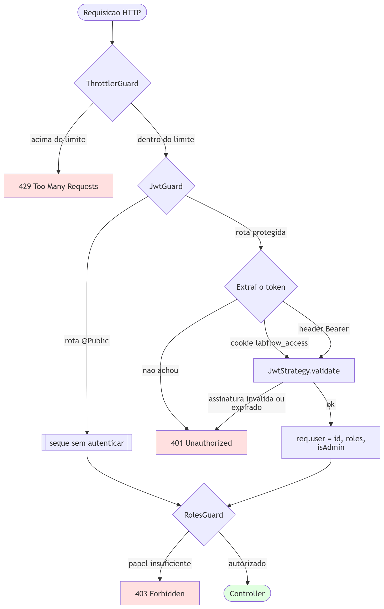
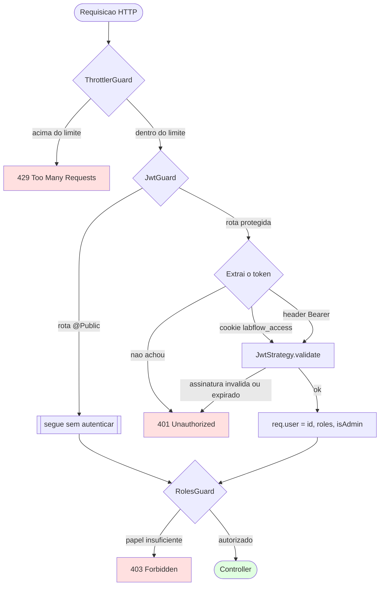
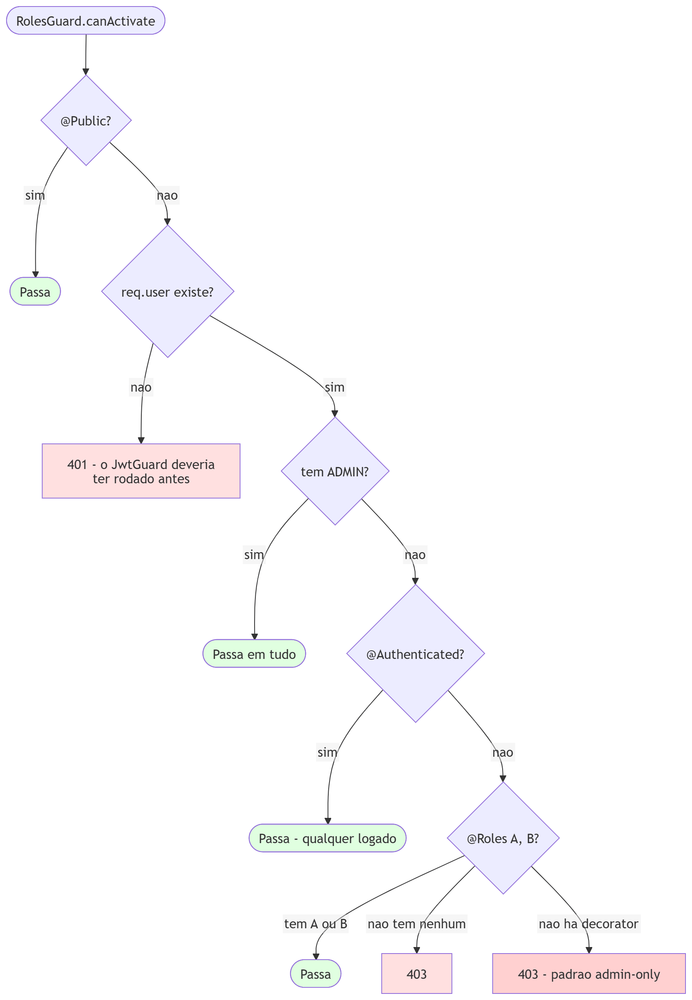
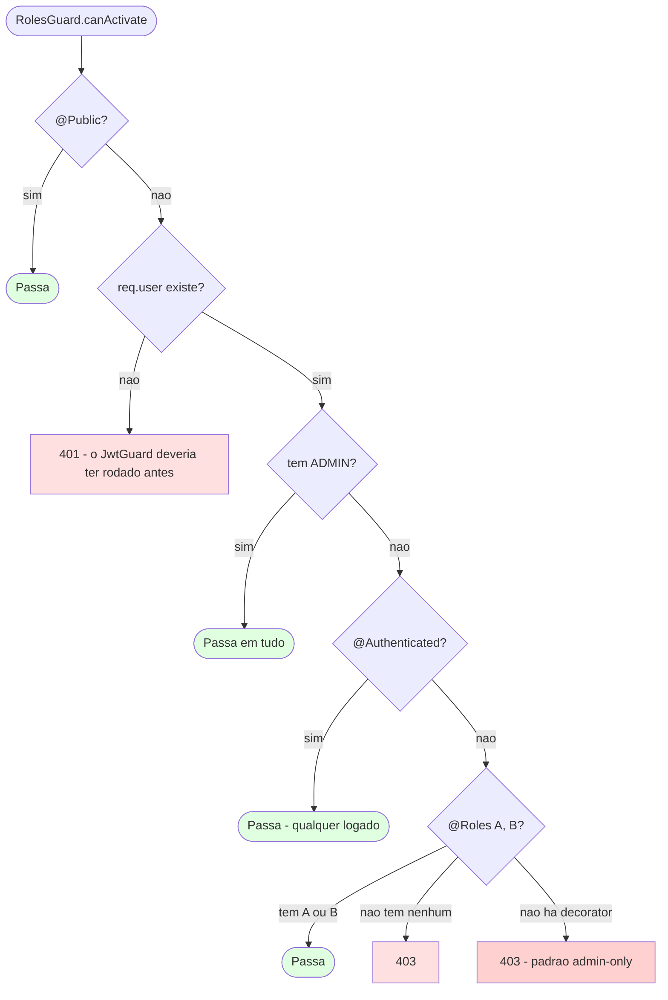
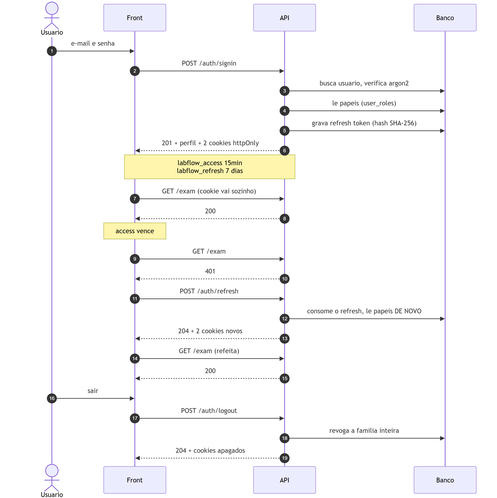
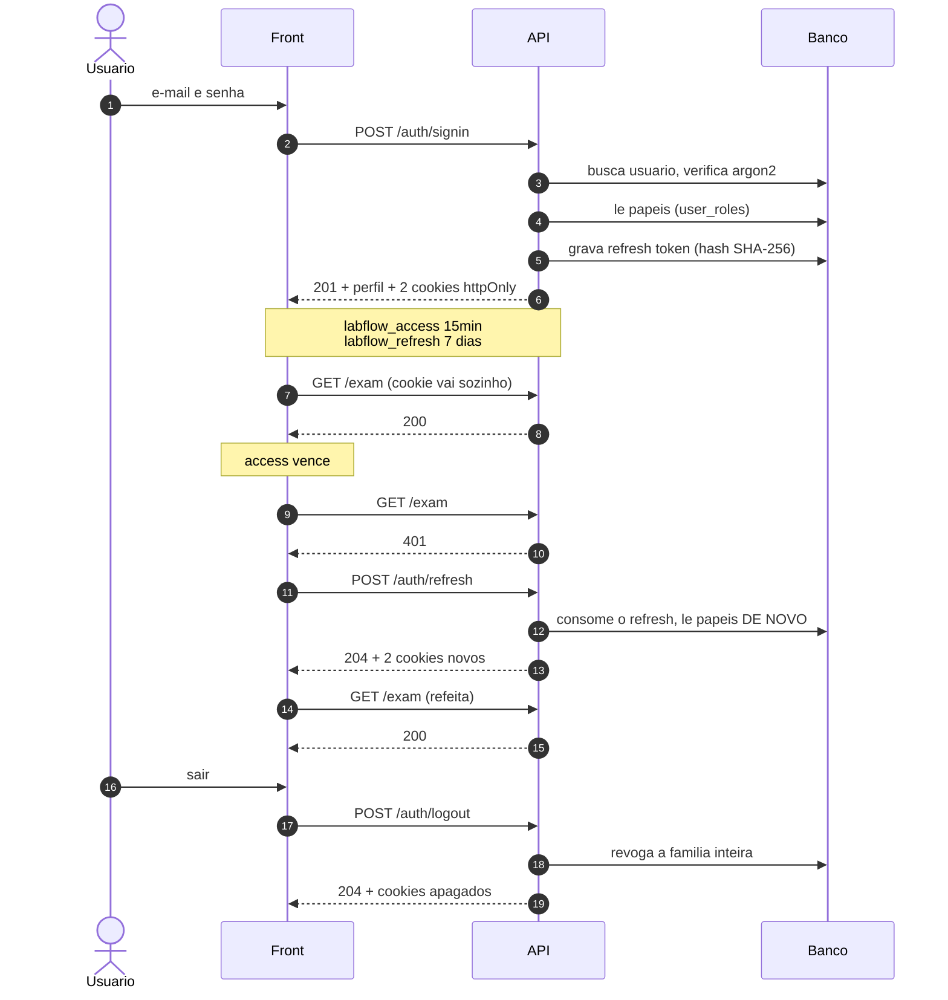
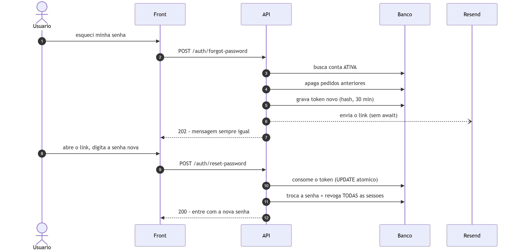
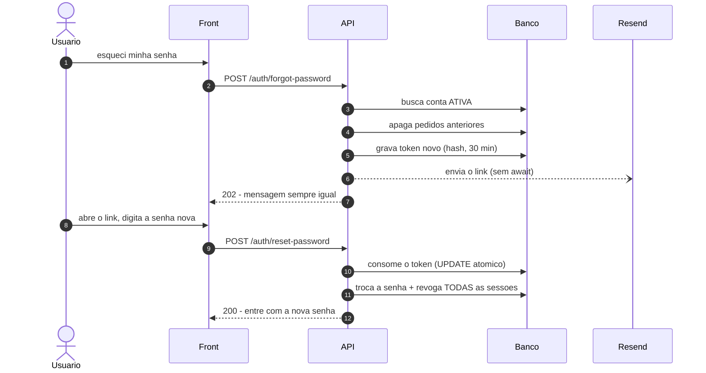
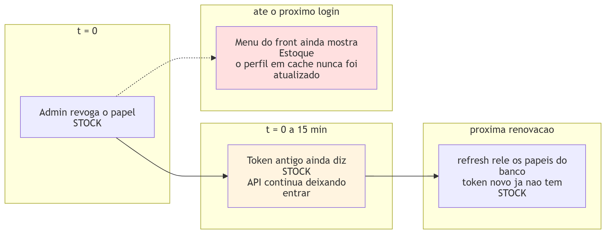
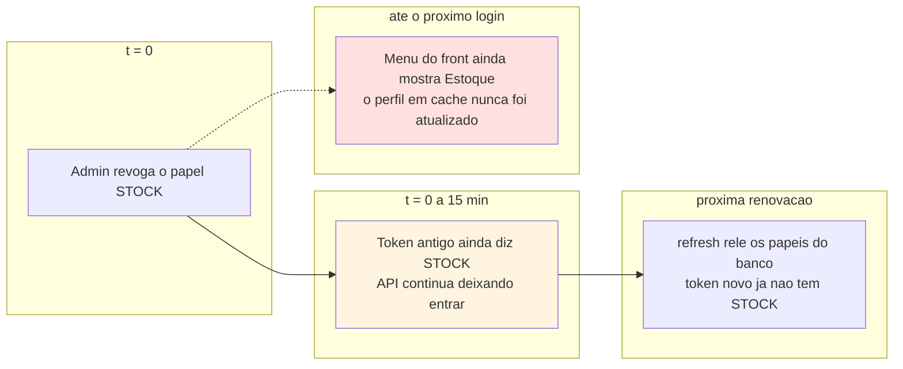

# Autenticação e autorização

Duas perguntas diferentes, respondidas por guards diferentes, e é útil manter
os nomes separados:

- **Autenticação** — *quem é você?* Responde o `JwtGuard`, lendo o token.
- **Autorização** — *você pode fazer isto?* Responde o `RolesGuard`, olhando os
  papéis que o token carrega.

Errar a distinção leva a diagnósticos errados: um `401` é "não sei quem você
é" (token ausente, vencido ou inválido); um `403` é "sei quem você é e a
resposta é não".

> **Estado:** espelha `src/main.ts`, `src/app.module.ts`,
> `src/common/guards/`, `src/common/strategy/jwt.strategy.ts`,
> `src/auth/auth-cookies.ts` e `src/auth/auth.service.ts` na data da última
> atualização deste arquivo.

---

## 1. A cadeia de guards

Três guards globais, registrados nesta ordem em `app.module.ts`. Toda
requisição atravessa os três antes de chegar ao controller.

Fonte Mermaid &middot; ampliar em <a href="img/10-cadeia-de-guards.svg">SVG</a>

**Por que o Throttler vem primeiro:** barrar excesso de requisições antes de
gastar CPU verificando assinatura de JWT. O limite global é 100 req/min por IP;
`/auth/signup` e `/auth/signin` sobrescrevem para **5 por minuto**, que é a
defesa contra força bruta de senha e contra criação em massa de contas.

**Por que o token pode vir de dois lugares:** o navegador manda cookie, porque
a página não consegue ler um cookie `httpOnly` e portanto não teria como montar
um header `Authorization`. O header continua valendo para quem não é navegador
— Swagger, testes e integração servidor-a-servidor, que não têm cookie jar.

Em produção há um quarto participante antes de todos: o Apache do host, que faz
o TLS e o proxy. É por causa dele que `main.ts` liga `trust proxy` — sem isso
`req.ip` seria `127.0.0.1` para todo mundo e o limite por IP viraria um balde
único compartilhado pelo laboratório inteiro.

---

## 2. A decisão do `RolesGuard`

Este é o diagrama que vale ler com atenção, porque o comportamento padrão é o
contrário do que se espera.

Fonte Mermaid &middot; ampliar em <a href="img/11-decisao-roles-guard.svg">SVG</a>

**O guard é *fail-closed*.** Uma rota sem decorator nenhum não é "aberta a
qualquer autenticado" — é **exclusiva de administrador**. Esquecer o decorator
fecha a porta em vez de abrir: o erro possível é uma rota que ninguém alcança,
nunca uma rota exposta por descuido.

Isso é uma escolha de projeto, não um efeito colateral. Rotas administrativas —
auditoria, gestão de usuários, logo e rodapé do laudo — não declaram papel
justamente porque administrar o sistema não é um papel delegável.

O `@Roles(A, B)` lista **alternativas, não requisitos somados**: passa quem tem
A *ou* B. No código é um `some`, não um `every`.

### Os quatro níveis, com as rotas de cada um

| Nível | Decorator | Rotas | Quais |
| --- | --- | --- | --- |
| Público | `@Public()` | 6 | Todo o `/auth` — a classe inteira é pública |
| Autenticado | `@Authenticated()` | 4 | `GET /settings`, `GET /user`, `GET /user/exam-staff`, `GET /user/:id` |
| Por papel | `@Roles(...)` | 30 | `/exam`, `/template`, `/patient`, `/anamnesis`, `/stock` |
| Administrador | *(nenhum)* | 9 | `/audit-log`, `POST`/`PUT`/`DELETE` de `/user`, logo e rodapé de `/settings`, e a raiz `/` |

Papéis: `ADMIN`, `EXAMS`, `EXAM_TEMPLATES`, `ANAMNESIS`, `PATIENTS`, `STOCK`.
A regra de negócio de cada um está em
[ROLES_E_PERMISSOES.md](../ROLES_E_PERMISSOES.md).

Duas rotas de leitura são deliberadamente mais largas que o controller em que
vivem: `GET /patient` e `GET /patient/:id` aceitam `PATIENTS`, `EXAMS`,
`EXAM_TEMPLATES` **ou** `ANAMNESIS`, porque quem lança um exame ou uma anamnese
precisa achar o paciente sem poder editá-lo.

---

## 3. O ciclo de vida de uma sessão

Fonte Mermaid &middot; ampliar em <a href="img/12-ciclo-de-sessao.svg">SVG</a>

O front nunca toca em token. Não há interceptor montando `Authorization`: quem
anexa a credencial é o navegador, sozinho, porque ela é um cookie. O que o
front tem é um interceptor de **resposta** — ao ver `401`, ele chama
`/auth/refresh` e refaz a requisição original uma vez.

O passo mais importante do diagrama é o **"lê papéis DE NOVO"**: a renovação
relê os papéis do banco em vez de copiá-los do token anterior. É isso que faz
uma concessão ou revogação valer sem esperar o usuário relogar — o assunto da
seção 5.

### Onde cada token vive

| | `labflow_access` | `labflow_refresh` |
| --- | --- | --- |
| O que é | JWT assinado | 32 bytes de CSPRNG, opaco |
| Carrega | `sub`, `roles`, `isAdmin` | nada — é só uma chave de busca |
| No banco | não existe | linha em `refresh_tokens`, guardada como SHA-256 |
| Validade | 15 min (`JWT_EXPIRES_IN`) | 7 dias (`REFRESH_TOKEN_DAYS`) |
| Uso | toda requisição à API | só `POST /auth/refresh` |
| Rotaciona | não — expira e é substituído | sim, a cada uso |

Os dois são `httpOnly`: o JavaScript da página não os lê, então um XSS não
consegue roubá-los. Antes o access token ficava no `localStorage` — ali,
qualquer script injetado levava a sessão inteira embora.

**`SameSite=lax` é a defesa contra CSRF hoje.** Com a credencial em cookie, o
navegador a anexa sozinho, inclusive numa requisição disparada por outro site.
É o `SameSite` que impede isso. Trocar para `none` — necessário só se o front
passar a viver em outro domínio de registro — **exige acrescentar um token
anti-CSRF junto**.

A rotação do refresh, a detecção de reúso e a janela de tolerância entre abas
estão desenhadas em
[banco-de-dados.md §6.1](banco-de-dados.md#61-ciclo-de-vida-do-refresh-token).

---

## 4. Redefinição de senha

Fonte Mermaid &middot; ampliar em <a href="img/13-redefinicao-de-senha.svg">SVG</a>

Três decisões que o diagrama não mostra sozinho:

**A resposta é sempre a mesma**, exista ou não a conta. Devolver "e-mail não
encontrado" transformaria a rota num verificador de cadastro: qualquer um
descobriria quais endereços têm conta no laboratório. É a mesma razão do
`Wrong credentials` uniforme no login.

**O e-mail sai sem `await`.** Não é descuido de assincronismo — é para o tempo
de resposta não denunciar o que a mensagem esconde. A chamada à Resend leva
centenas de milissegundos; esperá-la faria o caminho da conta existente
responder muito mais devagar que o da inexistente, e um cronômetro separaria os
dois casos.

**Trocar a senha derruba todas as sessões**, na mesma transação. O motivo mais
comum de redefinir senha é suspeita de conta comprometida; deixar de pé os
refresh tokens de sete dias manteria o invasor logado depois da troca. Em
transação porque, se a senha mudasse e a revogação falhasse, o usuário sairia
da operação achando que expulsou alguém que continua lá.

Conta **inativa não recebe link**: redefinir a senha não libera o acesso — quem
libera é a aprovação de um administrador. Mandar o e-mail só faria a pessoa
achar que resolveu.

---

## 5. A janela de 15 minutos

O access token carrega os papéis **dentro dele**. Enquanto ele vale, o
`RolesGuard` decide olhando o token, não o banco. Então uma mudança de papel não
vale na hora.

Fonte Mermaid &middot; ampliar em <a href="img/14-janela-de-15-minutos.svg">SVG</a>

São **duas janelas diferentes**, e a segunda é a que surpreende:

| O que fica desatualizado | Por quanto tempo | Por quê |
| --- | --- | --- |
| O que a API **permite** | ≤ 15 min | Os papéis vivem no access token; a renovação os relê do banco |
| O que a interface **mostra** | Até o próximo login | O perfil vem do `localStorage`, e `/auth/refresh` responde `204` sem corpo |

Na prática: conceder o papel `STOCK` a alguém libera a API em no máximo 15
minutos, mas o item "Estoque" **não aparece no menu** até a pessoa sair e entrar
de novo. Ela vai dizer que não recebeu o acesso — e a API vai dizer que
recebeu.

Isso está detalhado do lado do front em
[contrato-front-back.md](contrato-front-back.md#5-as-duas-janelas-de-desatualização),
com as opções para resolver.

Quatro eventos **não** esperam a janela, porque derrubam a sessão no banco:
logout, desativação da conta, redefinição de senha e detecção de reúso do
refresh token. Nos quatro casos a próxima renovação falha e o usuário volta ao
login.

---

## 6. Pontos de atenção

**O fallback de tokens legados ainda está no `JwtStrategy`.** Um token sem
`roles` no payload é tratado como emitido antes dos papéis existirem, e recebe
`[EXAMS, EXAM_TEMPLATES, ANAMNESIS, PATIENTS]` — ou `[ADMIN]`, se trouxer
`isAdmin: true`. Foi escrito para o deploy da migração não deslogar quem
estivesse online. Passados 15 minutos daquele deploy, nenhum token assim existe
mais; o código continua lá esperando a Fase 6 de
[ROLES_E_PERMISSOES.md](../ROLES_E_PERMISSOES.md).

**`Secure` na imagem Docker em desenvolvimento.** A imagem roda com
`NODE_ENV=production` mesmo na máquina do desenvolvedor, então os cookies saem
`Secure` também ali. Chrome e Firefox aceitam isso sobre `http://localhost`;
**o Safari não** — e como o access token agora também é cookie, o efeito lá não
é perder a renovação, é não conseguir autenticar.

**Errar o `path` do cookie mata a sessão em silêncio.** O `path` é comparado com
a URL vista pelo **navegador**, não com a rota interna do Nest. Se um proxy
publica a API sob um prefixo, um cookie preso em `/auth` simplesmente nunca é
enviado — e não há erro em lugar nenhum, só uma sessão que não dura.

**`GET /user/exam-staff` precisa continuar declarado antes de `GET /user/:id`.**
O Nest casa rotas na ordem de declaração; invertida, `exam-staff` seria
capturada como um `:id` e devolveria erro de validação de inteiro. Há um
comentário no controller avisando — e ele existe porque isso já é um erro
fácil de cometer numa refatoração.

---

## 7. O que este documento não cobre

- **A regra de negócio de cada papel** — quem pode o quê e por quê:
  [ROLES_E_PERMISSOES.md](../ROLES_E_PERMISSOES.md).
- **As tabelas de sessão** (`refresh_tokens`, `password_reset_tokens`), seus
  índices e o ciclo de revogação: [banco-de-dados.md](banco-de-dados.md).
- **O lado do front** — como ele guarda o perfil, protege as telas e renova
  sozinho: [contrato-front-back.md](contrato-front-back.md).
