# Modelagem do banco de dados

O modelo de dados do LabFlow: o que o sistema guarda, como as tabelas se ligam,
o que acontece quando algo é excluído, e **quais relações o banco não conhece**
porque vivem na aplicação.

Fonte: `src/entities/*.entity.ts` + `src/migrations/*.ts`. Gerado a partir do
código, não de um banco rodando — se divergirem, o código é quem manda, e a
divergência é bug.

> **Estado:** schema até a migration `AddExamInternalObservation`
> (`1784166400000`), a 16ª. `synchronize: false` nos dois data sources — toda
> mudança de schema passa por migration manual.

Cada diagrama aparece como **imagem** (PNG), com a fonte Mermaid logo abaixo num
bloco recolhido e um link para o **SVG**, que amplia sem borrar. A fonte Mermaid
é a verdade — a imagem é derivada dela, e quem editar um diagrama precisa regerar
a imagem ([como fazer](uml-classes.md#regerar-as-imagens)).

| Seção | Para quê |
| --- | --- |
| [1. Modelo conceitual](#1-modelo-conceitual) | Entender o domínio sem olhar coluna |
| [2. Modelo lógico completo](#2-modelo-lógico-completo) | **O modelo do banco** — todas as tabelas e colunas |
| [3–7](#3-cardinalidades-e-comportamento-na-exclusão) | Cardinalidade, exclusão e detalhe por área |
| [8–13](#8-as-quatro-relações-que-o-banco-não-conhece) | Regras que o diagrama não mostra |

> Procurando o **diagrama de classes UML** (entidades TypeScript, tipos da
> linguagem e os oito enums)? Está em
> [uml-classes.md](uml-classes.md) — é a mesma modelagem, uma camada acima.

---

## 1. Modelo conceitual

O domínio em entidades e relacionamentos, sem colunas. É o desenho que responde
"o que este sistema guarda" — os nomes aqui são de negócio, não de tabela.

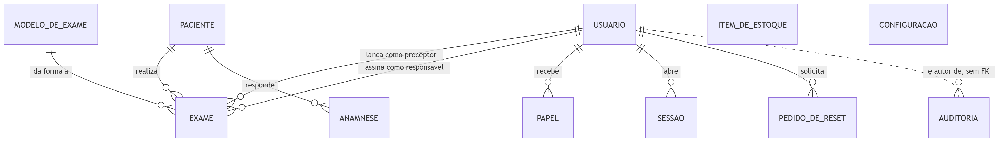

<details>
<summary>Fonte Mermaid &middot; ampliar em <a href="img/01-modelo-conceitual.svg">SVG</a></summary>

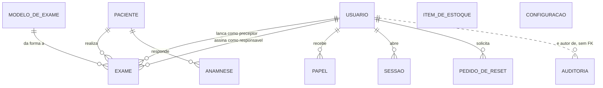

</details>

Cinco leituras que este desenho já entrega:

1. **O paciente é o centro clínico.** Exame e anamnese só existem presos a um
   paciente; nenhum dos dois existe sozinho.
2. **O usuário aparece duas vezes no mesmo exame** — como preceptor e como
   responsável. São dois papéis distintos sobre o mesmo laudo, e por isso duas
   colunas, não uma.
3. **O modelo de exame dá forma ao exame**, e não o contrário: os campos que um
   exame aceita são definidos no modelo (§8.1).
4. **A auditoria é ligada por linha tracejada** porque não existe chave
   estrangeira ali. Ela guarda o id do autor, e também aponta para **qualquer
   uma das seis entidades auditáveis** (exame, modelo, paciente, anamnese, item
   de estoque, usuário) através de um par `entidade` + `id` — polimorfismo que
   nenhuma FK pode expressar (§8.2).
5. **Estoque e configuração não se relacionam com nada.** Não é esquecimento:
   o estoque do laboratório não é consumido por exame nenhum no modelo atual, e
   a configuração é uma linha única de identidade visual do laudo.

---

## 2. Modelo lógico completo

As 11 tabelas com todas as colunas, chaves e relacionamentos. É o modelo do
banco propriamente dito — o que um `pg_dump --schema-only` descreveria.

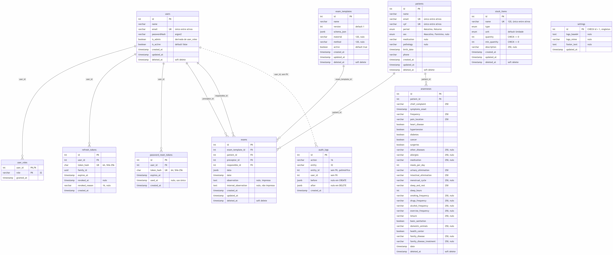

<details>
<summary>Fonte Mermaid &middot; ampliar em <a href="img/02-modelo-logico-completo.svg">SVG</a></summary>

```mermaid
erDiagram
    users          ||--o{ user_roles            : "user_id"
    users          ||--o{ refresh_tokens        : "user_id"
    users          ||--o{ password_reset_tokens : "user_id"
    users          ||--o{ exams                 : "preceptor_id"
    users          ||--o{ exams                 : "responsible_id"
    patients       ||--o{ exams                 : "patient_id"
    patients       ||--o{ anamneses             : "patient_id"
    exam_templates ||--o{ exams                 : "exam_template_id"
    users          ||..o{ audit_logs            : "user_id, sem FK"

    users {
        int       id            PK
        varchar   name
        varchar   email         UK "único entre ativos"
        varchar   passwordHash  "argon2"
        boolean   is_admin      "derivada de user_roles"
        boolean   is_active     "default false"
        timestamp created_at
        timestamp updated_at
        timestamp deleted_at    "soft delete"
    }

    user_roles {
        int       user_id    PK,FK
        varchar   role       PK "32"
        timestamp granted_at
    }

    refresh_tokens {
        int       id             PK
        int       user_id        FK
        char      token_hash     UK "64, SHA-256"
        uuid      family_id
        timestamp expires_at
        timestamp revoked_at     "nulo"
        varchar   revoked_reason "16, nulo"
        timestamp created_at
    }

    password_reset_tokens {
        int       id         PK
        int       user_id    FK
        char      token_hash UK "64, SHA-256"
        timestamp expires_at
        timestamp used_at    "nulo, uso único"
        timestamp created_at
    }

    patients {
        int       id         PK
        varchar   name
        varchar   email      UK "único entre ativos"
        varchar   cpf        UK "único entre ativos"
        enum      period     "Matutino, Noturno"
        enum      sex        "Masculino, Feminino, nulo"
        varchar   medication "nulo"
        varchar   pathology  "nulo"
        timestamp birth_date
        varchar   phone
        timestamp created_at
        timestamp updated_at
        timestamp deleted_at "soft delete"
    }

    exam_templates {
        int       id          PK
        varchar   name
        int       version     "default 1"
        jsonb     schema_json
        varchar   material    "120, nulo"
        varchar   method      "120, nulo"
        boolean   active      "default true"
        timestamp created_at
        timestamp updated_at
        timestamp deleted_at  "soft delete"
    }

    exams {
        int       id                   PK
        int       exam_template_id     FK
        int       patient_id           FK
        int       preceptor_id         FK
        int       responsible_id       FK
        jsonb     data
        timestamp date
        text      observation          "nulo, impressa"
        text      internal_observation "nulo, não impressa"
        timestamp created_at
        timestamp updated_at
        timestamp deleted_at           "soft delete"
    }

    anamneses {
        int       id                       PK
        int       patient_id               FK
        varchar   chief_complaint          "250"
        timestamp symptoms_onset
        varchar   frequency                "250"
        varchar   pain_location            "250"
        boolean   heart_disease
        boolean   hypertension
        boolean   diabetes
        boolean   cancer
        boolean   surgeries
        varchar   other_diseases           "250, nulo"
        varchar   allergies                "250, nulo"
        varchar   medication               "250, nulo"
        int       meals_per_day
        varchar   urinary_elimination      "250"
        varchar   intestinal_elimination   "250"
        varchar   menstrual_cycle          "250, nulo"
        varchar   sleep_and_rest           "250"
        int       sleep_hours
        varchar   smoking_frequency        "250, nulo"
        varchar   drugs_frequency          "250, nulo"
        varchar   alcohol_frequency        "250, nulo"
        varchar   exercise_frequency       "250, nulo"
        varchar   leisure                  "250, nulo"
        boolean   basic_sanitation
        varchar   domestic_animals         "250, nulo"
        boolean   health_center
        varchar   family_disease           "250, nulo"
        varchar   family_disease_treatment "250, nulo"
        timestamp date
        timestamp deleted_at               "soft delete"
    }

    stock_items {
        int       id           PK
        varchar   name         UK "120, único entre ativos"
        enum      type
        enum      unit         "default Unidade"
        int       quantity     "CHECK >= 0"
        int       min_quantity "CHECK >= 0"
        varchar   description  "250, nulo"
        timestamp created_at
        timestamp updated_at
        timestamp deleted_at   "soft delete"
    }

    audit_logs {
        int       id        PK
        varchar   action    "16"
        varchar   entity    "32"
        int       entity_id "sem FK, polimórfico"
        int       user_id   "sem FK"
        jsonb     before    "nulo em CREATE"
        jsonb     after     "nulo em DELETE"
        timestamp created_at
    }

    settings {
        int       id          PK "CHECK id = 1, singleton"
        text      logo_base64 "nulo"
        varchar   logo_mime   "nulo"
        text      footer_text "nulo"
        timestamp updated_at
    }
```

</details>

**Como ler as marcações:** `PK` chave primária, `FK` chave estrangeira, `UK`
unicidade — e toda `UK` deste schema é um **índice único parcial**, válido só
entre os registros não excluídos (§9.1). A linha tracejada de `users` para
`audit_logs` é relação lógica: existe no código, não no banco.

> Este é o maior diagrama do conjunto: **8000 × 3339 px** no PNG. É o tamanho
> natural de um modelo com 11 tabelas e ~95 colunas — encolhido na largura da
> página, o texto some. Clique na imagem para abrir em tamanho real, ou use o
> [SVG](img/02-modelo-logico-completo.svg), que amplia sem borrar. Para ler em
> linha, sem ampliar nada, vá pelos zooms por área nos §5–7.

Os enums `type` e `unit` de `stock_items` e `period`/`sex` de `patients` são
tipos enum do próprio Postgres; os valores estão em §5 e §7. Já `role`, `action`
e `entity` são `varchar` — esses valores vivem no código (§8.4, §12).

---

## 3. Cardinalidades e comportamento na exclusão

| De → Para | Cardinalidade | Coluna | ON DELETE | Por quê |
| --- | --- | --- | --- | --- |
| `users` → `user_roles` | 1 : N | `user_id` | **CASCADE** | Papel não existe sem usuário. |
| `users` → `refresh_tokens` | 1 : N | `user_id` | **CASCADE** | Sessão não sobrevive ao dono. |
| `users` → `password_reset_tokens` | 1 : N | `user_id` | **CASCADE** | Idem. |
| `users` → `exams` (preceptor) | 1 : N | `preceptor_id` | `NO ACTION` | A autoria do laudo é histórico: não pode sumir. |
| `users` → `exams` (responsável) | 1 : N | `responsible_id` | `NO ACTION` | Idem. |
| `patients` → `exams` | 1 : N | `patient_id` | `NO ACTION` | Registro clínico tem retenção legal. |
| `patients` → `anamneses` | 1 : N | `patient_id` | `NO ACTION` | Idem. |
| `exam_templates` → `exams` | 1 : N | `exam_template_id` | `NO ACTION` | O exame só é legível junto do modelo que o gerou. |

**O detalhe que amarra tudo:** os três CASCADE nunca disparam na prática.
`users` usa *soft delete* — a linha permanece com `deleted_at` preenchido, então
não há `DELETE` físico para cascatear. O que efetivamente encerra a sessão de um
usuário desativado é a checagem de `isActive` na renovação do refresh token,
não o banco. O CASCADE existe como rede de segurança para uma exclusão física
manual (limpeza de LGPD, correção de dados), não como o caminho normal.

Pelo mesmo motivo, os `NO ACTION` nunca são violados: nenhuma das tabelas
referenciadas apaga linha.

---

## 4. Por que o modelo se divide em três blocos

O modelo lógico tem 11 tabelas, mas só **um** ponto de contato entre o mundo
clínico e o mundo da identidade — e três tabelas que não se ligam a nada.

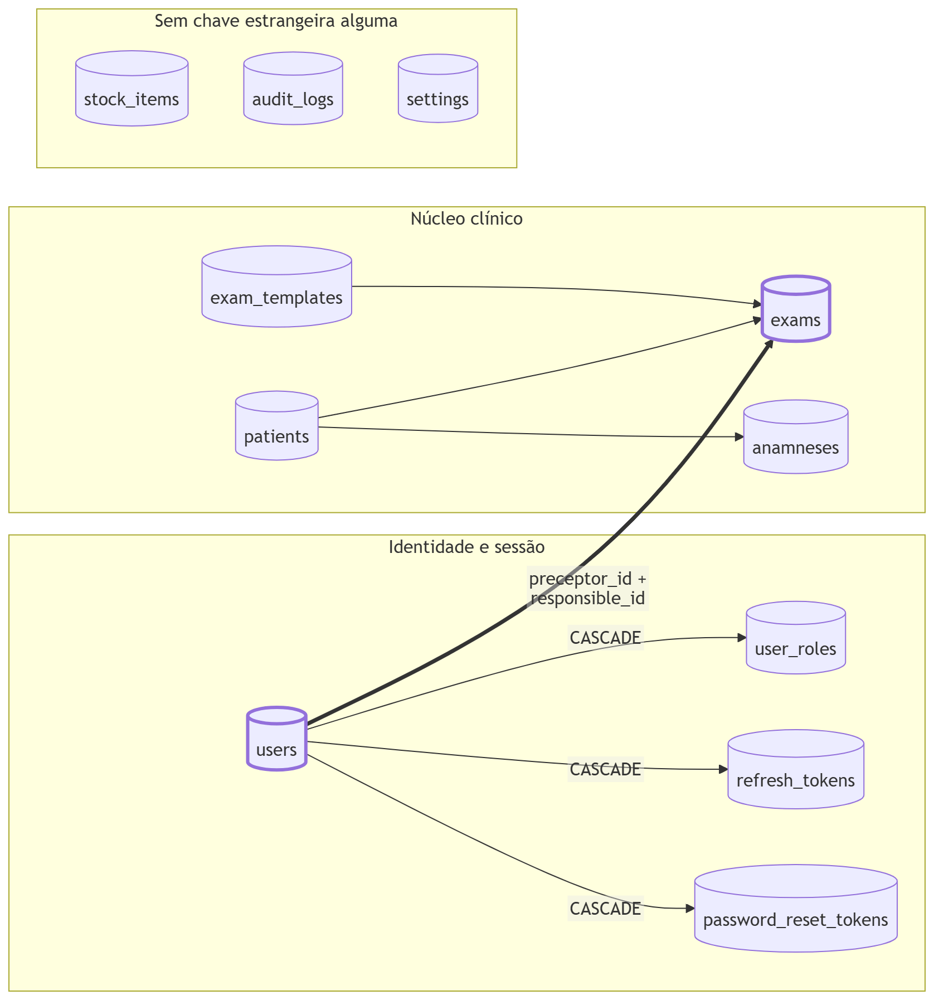

<details>
<summary>Fonte Mermaid &middot; ampliar em <a href="img/03-tres-blocos.svg">SVG</a></summary>

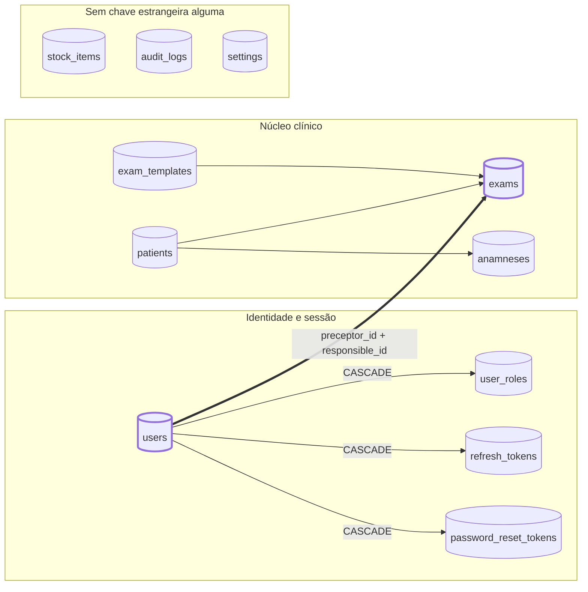

</details>

A seta grossa é a **única costura estrutural** entre os dois blocos conectados.
Ela também é a razão de `users` não poder ser excluído fisicamente: os exames
guardam quem foi o preceptor e quem foi o responsável, e essa autoria é
justamente o que um laudo precisa provar anos depois.

As três seções seguintes são zooms: o mesmo modelo do §2, um bloco por vez, com
o significado de cada coluna.

---

## 5. Zoom: núcleo clínico

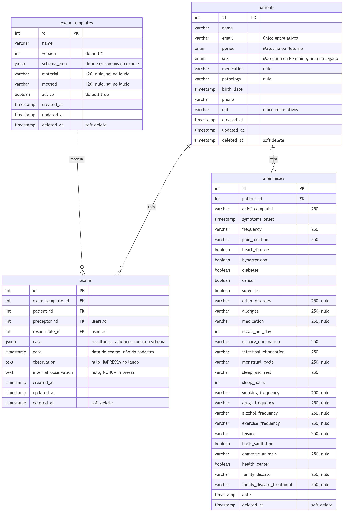

<details>
<summary>Fonte Mermaid &middot; ampliar em <a href="img/04-zoom-nucleo-clinico.svg">SVG</a></summary>

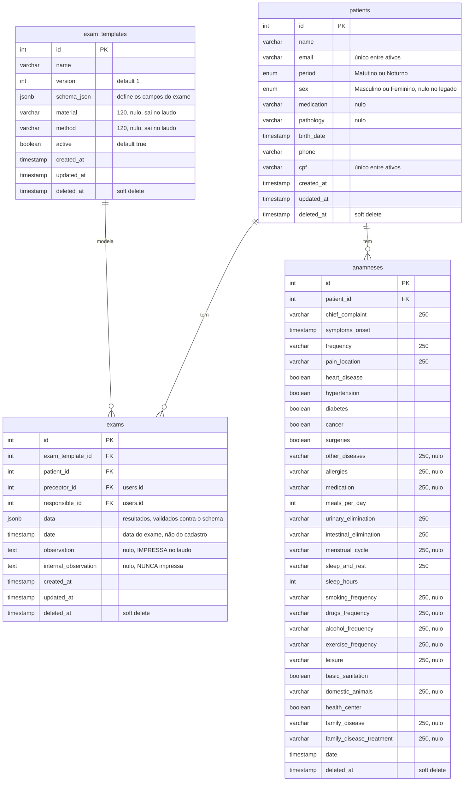

</details>

Três assimetrias que valem reparar:

1. **`anamneses` não tem `created_at`/`updated_at`.** Só `date` (informada) e
   `deleted_at`. Não dá para saber quando uma anamnese foi digitada nem quando
   foi editada pela última vez — só o `audit_logs` responde isso.
2. **`exams.date` ≠ `exams.created_at`.** A primeira é a data do exame,
   informada pelo operador; a segunda é quando a linha entrou no banco. Um
   relatório por período precisa escolher — e a escolha muda o número.
3. **`exam_templates.version` existe, mas não há chave por versão.** O `id` é a
   identidade; `version` é informativo. Duas versões do mesmo modelo são duas
   linhas independentes, sem coluna que as ligue.

---

## 6. Zoom: identidade e sessão

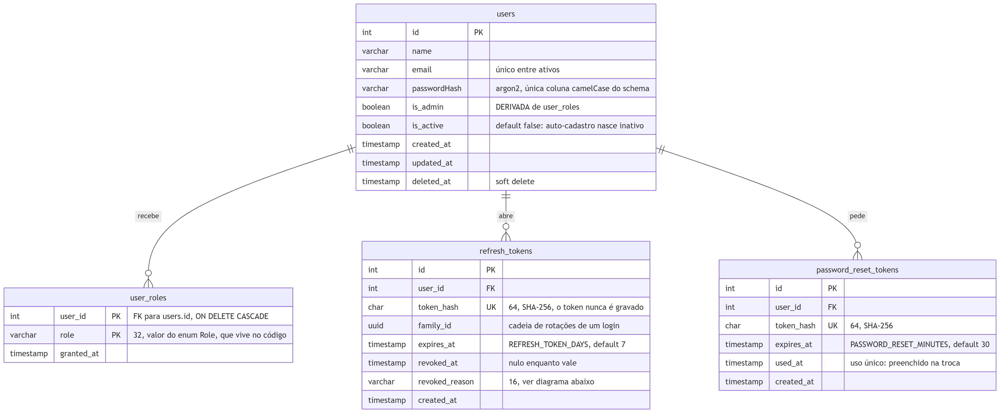

<details>
<summary>Fonte Mermaid &middot; ampliar em <a href="img/05-zoom-identidade-sessao.svg">SVG</a></summary>

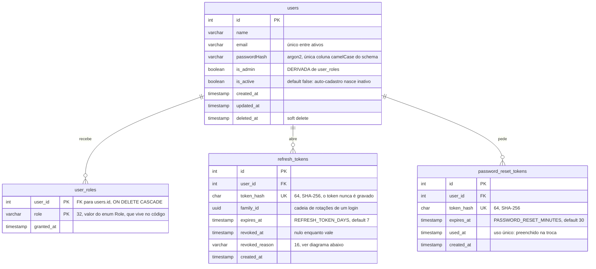

</details>

### 6.1 Ciclo de vida do refresh token

O desenho mais sutil do schema inteiro está em duas colunas: `revoked_reason` e
`family_id`.

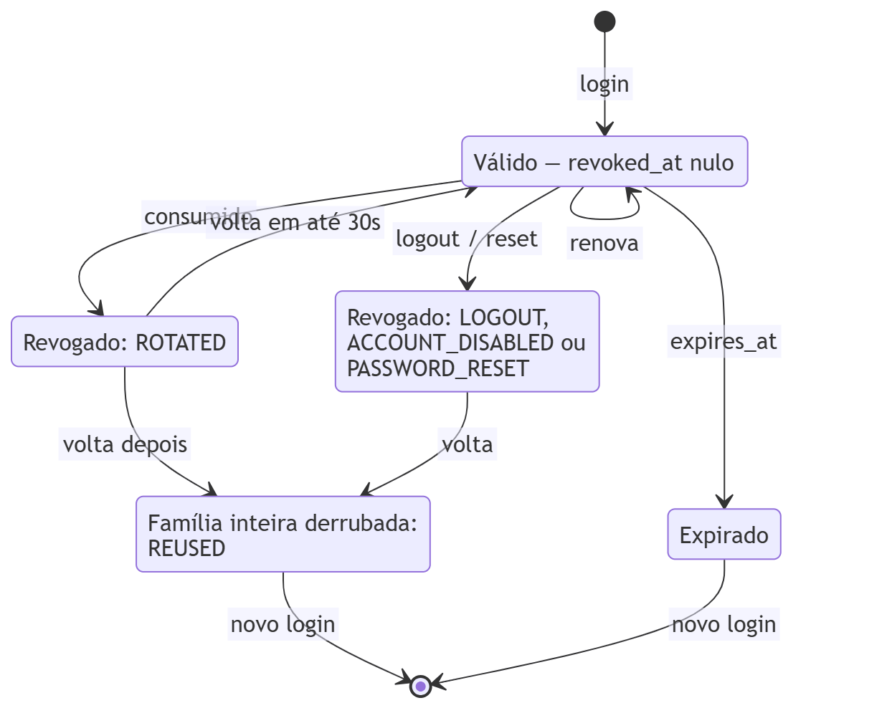

<details>
<summary>Fonte Mermaid &middot; ampliar em <a href="img/06-ciclo-refresh-token.svg">SVG</a></summary>

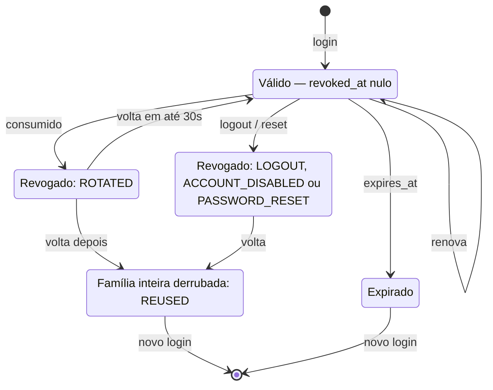

</details>

Os dois caminhos que saem de `ROTATED` são a decisão de segurança do desenho.
Um token já consumido voltando **dentro** de 30 segundos é corrida entre abas —
duas abas tomaram 401 juntas e renovaram com o mesmo cookie; derrubar a sessão
aí seria punir o uso normal. Voltando **depois**, é o sintoma clássico de cookie
copiado: o ladrão e o dono usam a mesma cadeia, não há como saber qual é qual, e
a `family_id` inteira cai.

A janela (`REFRESH_REUSE_GRACE_SECONDS`, default 30) vale **só para `ROTATED`** —
e é essa restrição que impede a tolerância de virar furo. Um token derrubado por
logout, desativação ou troca de senha morre no ato: dar carona a ele devolveria
ao atacante alguns segundos para renovar, anulando a própria revogação.

---

## 7. Zoom: as três ilhas

Nenhuma FK entra ou sai destas tabelas.

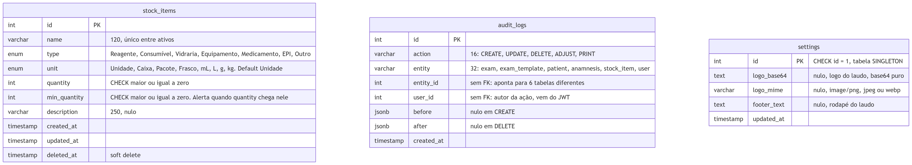

<details>
<summary>Fonte Mermaid &middot; ampliar em <a href="img/07-zoom-ilhas.svg">SVG</a></summary>

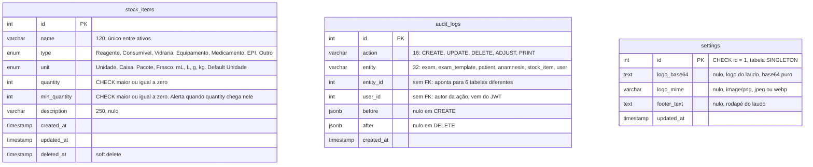

</details>

`settings` é a única tabela sem `created_at` — faz sentido: a linha nasce na
própria migration (`INSERT ... id=1`) e nunca é criada de novo.

`audit_logs` é a única tabela **sem soft delete e sem `updated_at`**: um log que
pode ser editado ou apagado não é log.

---

## 8. As quatro relações que o banco não conhece

Este é o conteúdo que um modelo puro esconde. Todas as quatro são mantidas pela
aplicação; nenhuma tem constraint que as proteja.

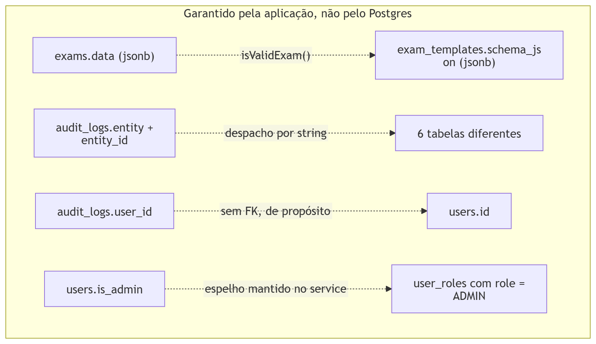

<details>
<summary>Fonte Mermaid &middot; ampliar em <a href="img/08-relacoes-sem-fk.svg">SVG</a></summary>

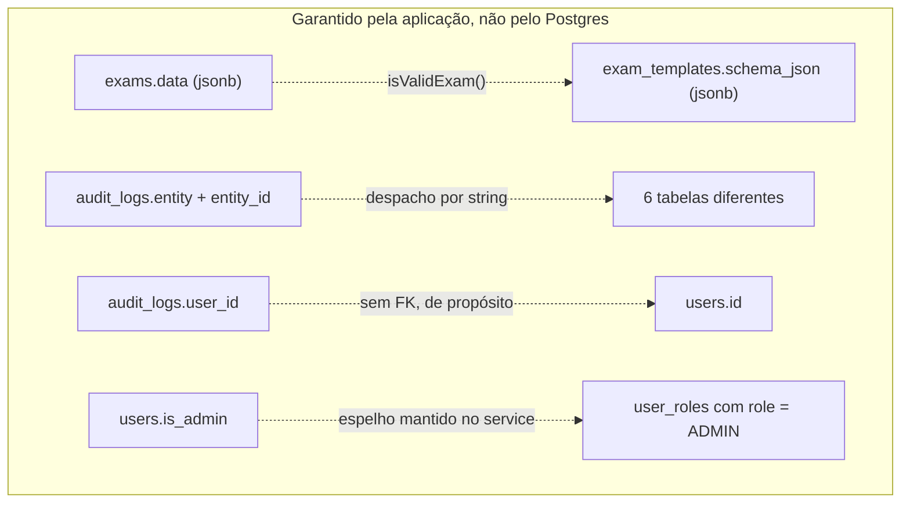

</details>

### 8.1 `exams.data` ↔ `exam_templates.schema_json`

O contrato mais importante do sistema, e ele é validado **em JavaScript**
(`src/exam/validators/exam.validator.ts`), não pelo Postgres:

- `schema_json` é um objeto `{ campo: { references: { rótulo: valor } } }`,
  não-vazio, validado por `validateSchema()`.
- `data` precisa ter **exatamente o mesmo conjunto de chaves** que o schema —
  mesma quantidade, mesmos nomes — e cada valor precisa ser escalar
  (`number`, `string` ou `null`). Objetos e arrays aninhados são recusados.

Consequência prática: **um `UPDATE` no `schema_json` de um modelo já usado
quebraria os exames antigos**. Eles continuariam gravados, mas deixariam de
validar contra o modelo, e nenhuma consulta avisaria.

Nada no banco impede esse `UPDATE` — nem constraint, nem trigger. Quem o impede
é a API, do jeito mais simples possível: `UpdateExamTemplateDto` **não declara o
campo `schema`**, e o `ValidationPipe` roda com `whitelist: true`, então um
`PUT` que envie o schema tem o campo descartado antes de chegar ao serviço. A
única rota que muda os campos é `POST /template/update/:id`, e ela insere uma
linha nova em vez de alterar a existente — é para isso que a coluna `version`
existe. Ver
[ciclo-de-vida-de-um-exame.md §4](ciclo-de-vida-de-um-exame.md#4-por-que-o-modelo-é-versionado-e-não-editado).

A brecha que sobra é escrever direto no Postgres: um script de migração de
dados ou um `psql` contornam a proteção inteira, porque ela mora na camada
errada para isso.

### 8.2 `audit_logs.entity` + `entity_id` — referência polimórfica

Uma única coluna `entity_id` aponta para `exams`, `exam_templates`, `patients`,
`anamneses`, `stock_items` ou `users`, conforme a string em `entity`. É o preço
de ter uma tabela de log só: nenhuma FK pode ser declarada, e um `entity_id`
órfão só aparece na leitura.

O índice `(entity, entity_id)` existe justamente porque toda consulta útil passa
por esse par.

### 8.3 `audit_logs.user_id` — sem FK, de propósito

Está documentado na entidade: se o usuário for removido, o log histórico
continua válido. Uma FK aqui obrigaria a escolher entre apagar o log e impedir
a remoção do usuário — as duas piores opções para uma trilha de auditoria.

O efeito colateral é que o log guarda o **id**, não o nome: exibir "quem fez"
exige um join que pode não encontrar ninguém.

### 8.4 `users.is_admin` ↔ `user_roles`

`is_admin` é uma coluna **derivada**: vale `true` exatamente quando existe uma
linha em `user_roles` com `role = 'ADMIN'`. Mantida em sincronia pelo
`UserService`/`AuthService` porque responder "existe admin ativo?" com um
booleano é muito mais barato que com um join.

A autorização em si (`RolesGuard`) lê os papéis, não esta coluna. A divergência
entre as duas é silenciosa: nenhum trigger, nenhuma constraint. A migration
`AddUserRoles` estabeleceu o estado inicial coerente:

| Antes | Papéis atribuídos no backfill |
| --- | --- |
| `is_admin = true` | `ADMIN` |
| `is_admin = false` | `EXAMS`, `EXAM_TEMPLATES`, `ANAMNESIS`, `PATIENTS` |

E `user_roles.role` é `varchar(32)`, não um enum do Postgres: os papéis vivem no
código (`src/common/enums/role.enum.ts`) porque criar um papel novo exige guard
e tela de qualquer forma — é um deploy, não um `INSERT`.

---

## 9. Soft delete: quem tem, e o que isso implica

| Tabela | `deleted_at` | Observação |
| --- | --- | --- |
| `users` | sim | Preserva autoria de exames |
| `patients` | sim | Retenção do histórico clínico |
| `exams` | sim | |
| `exam_templates` | sim | |
| `anamneses` | sim | Adicionado depois (`AddAnamnesisSoftDelete`) |
| `stock_items` | sim | Preserva o histórico de auditoria do item |
| `user_roles` | não | Some junto com o usuário (CASCADE) |
| `refresh_tokens` | não | Tem `revoked_at`, que é outra coisa |
| `password_reset_tokens` | não | Tem `used_at` |
| `audit_logs` | não | Log não se apaga |
| `settings` | não | Linha única |

O TypeORM esconde as linhas com `deleted_at IS NOT NULL` em `find`/`findOne`
automaticamente. **Query bruta em `QueryBuilder` ou SQL não ganha esse filtro de
graça** — é a origem clássica de "o paciente excluído voltou a aparecer no
relatório".

### 9.1 Unicidade só entre ativos

Todo índice único do schema é **parcial**, com `WHERE deleted_at IS NULL`:

```sql
CREATE UNIQUE INDEX "ux_users_email_active"      ON "users"       ("email") WHERE deleted_at IS NULL;
CREATE UNIQUE INDEX "ux_patients_email_active"   ON "patients"    ("email") WHERE deleted_at IS NULL;
CREATE UNIQUE INDEX "ux_patients_cpf_active"     ON "patients"    ("cpf")   WHERE deleted_at IS NULL;
CREATE UNIQUE INDEX "ux_stock_items_name_active" ON "stock_items" ("name")  WHERE deleted_at IS NULL;
```

É o que permite recadastrar um CPF cujo paciente foi excluído. As constraints
`UNIQUE` totais originais foram removidas pela migration
`ChangeUniqueConstraint` — e o `down()` dela as recoloca, o que **falha se
houver duplicata entre um registro ativo e um excluído**. Reverter essa
migration num banco com histórico não é operação automática.

---

## 10. Inventário de índices

| Índice | Tabela | Colunas | Tipo |
| --- | --- | --- | --- |
| `ux_users_email_active` | `users` | `email` | Único parcial |
| `ux_patients_email_active` | `patients` | `email` | Único parcial |
| `ux_patients_cpf_active` | `patients` | `cpf` | Único parcial |
| `ux_stock_items_name_active` | `stock_items` | `name` | Único parcial |
| `idx_user_roles_user` | `user_roles` | `user_id` | Comum |
| `idx_refresh_tokens_user` | `refresh_tokens` | `user_id` | Comum |
| `idx_refresh_tokens_family` | `refresh_tokens` | `family_id` | Comum |
| `UQ_refresh_tokens_hash` | `refresh_tokens` | `token_hash` | Único |
| `idx_password_reset_tokens_user` | `password_reset_tokens` | `user_id` | Comum |
| `UQ_password_reset_tokens_hash` | `password_reset_tokens` | `token_hash` | Único |
| `IDX_audit_logs_entity` | `audit_logs` | `entity`, `entity_id` | Comum |
| `IDX_audit_logs_created_at` | `audit_logs` | `created_at` | Comum |

**Não há índice em `exams.patient_id`, `exams.date` nem em
`anamneses.patient_id`.** Hoje isso não aparece — com o volume atual o Postgres
prefere seq scan de qualquer jeito. Vira o primeiro gargalo quando a listagem
de exames por paciente e o recorte por período (ver
[DASHBOARD_ANALITICO.md](../DASHBOARD_ANALITICO.md)) começarem a doer.

---

## 11. Linhagem do schema

As 16 migrations, na ordem em que rodam. O prefixo numérico é o timestamp, e é
ele que define a ordem — não o nome do arquivo.

| # | Migration | O que fez |
| --- | --- | --- |
| 1 | `InitialSchema` | Baseline: `users`, `patients`, `exam_templates`, `exams`, `anamneses` |
| 2 | `ChangeUniqueConstraint` | Trocou `UNIQUE` total por índice parcial `WHERE deleted_at IS NULL` |
| 3 | `AddUserIsActive` | `users.is_active` — aprovação de admin |
| 4 | `AddAnamnesisSoftDelete` | `anamneses.deleted_at` |
| 5 | `AddSettings` | Tabela singleton + linha `id = 1` |
| 6 | `CreateAuditLogs` | `audit_logs` + 2 índices |
| 7 | `AddSettingsFooter` | `settings.footer_text` |
| 8 | `AddStockItems` | `stock_items`, 2 enums, 2 CHECKs |
| 9 | `AddUserRoles` | `user_roles` + **backfill** dos papéis a partir de `is_admin` |
| 10 | `ReclassifyStockAdjustLogs` | Dados: reclassificou logs de estoque para `ADJUST` |
| 11 | `AddRefreshTokens` | `refresh_tokens` |
| 12 | `AddPasswordResetTokens` | `password_reset_tokens` |
| 13 | `NormalizeUserEmails` | Dados: normalizou e-mails |
| 14 | `AddExamReportFields` | `exam_templates.material`, `.method`, `exams.observation` |
| 15 | `AddPatientSex` | `patients.sex` (enum, nulo no legado) |
| 16 | `AddExamInternalObservation` | `exams.internal_observation` |

Duas migrations (**10** e **13**) mexem só em dados, não em estrutura.

O `down()` da **1** é deliberadamente um no-op: derrubar as tabelas da baseline
destruiria dados de produção.

---

## 12. Convenções do schema

| Convenção | Regra | Exceção |
| --- | --- | --- |
| Nome de tabela | `snake_case`, plural | — |
| Nome de coluna | `snake_case` | **`users.passwordHash`** — a única camelCase do banco inteiro |
| PK | `id` `SERIAL` | `user_roles` (composta `user_id + role`), `settings` (`id = 1` fixo) |
| Timestamps | `created_at` / `updated_at` / `deleted_at` | `anamneses` (sem os dois primeiros), `settings` (sem `created_at`), `audit_logs` (só `created_at`) |
| Enum | Tipo `enum` do Postgres, nome `<tabela>_<coluna>_enum` | `user_roles.role` e `audit_logs.action`/`entity` são `varchar` — os valores vivem no código |
| Segredo | Nunca em claro: `argon2` para senha, `SHA-256` para tokens | — |
| Migration | Manual, `IF NOT EXISTS` / `ON CONFLICT DO NOTHING` para ser reexecutável | — |

---

## 13. Pontos de atenção

1. **`users.passwordHash` quebra a convenção.** Toda query bruta precisa das
   aspas duplas (`SELECT "passwordHash"`), porque sem elas o Postgres
   normaliza para minúsculo e não encontra a coluna.
2. **`audit-log.entity.ts` declara `@Index(['entity','entityId'])` sem nome**,
   enquanto a migration criou `IDX_audit_logs_entity`. Com `synchronize: false`
   é inofensivo, mas um `migration:generate` vai propor criar um índice
   duplicado. Nomear o `@Index` na entidade resolve.
3. **Nada garante `users.is_admin` = existe papel ADMIN.** Um `UPDATE` manual
   em qualquer um dos dois lados abre a divergência sem aviso (§8.4).
4. **Editar `schema_json` de um modelo em uso invalida exames existentes**
   (§8.1). O `version` sugere versionar; o banco permite editar.
5. **`exams` e `anamneses` sem índice em `patient_id`** (§10).

---

## 14. O que este documento não cobre

Estes são os próximos diagramas — nenhum deles existe ainda:

- **Módulos NestJS** — quem importa quem, e onde os guards globais entram.
- **Autenticação e autorização** — o caminho de um request do cookie ao
  `RolesGuard`, e a janela de 15 minutos entre revogar um papel e ele sumir do
  token. Contexto atual em [ROLES_E_PERMISSOES.md](../ROLES_E_PERMISSOES.md).
- **Ciclo de vida de um exame** — do lançamento à emissão do laudo, com os
  pontos onde a auditoria é gravada. Contexto em
  [AUDIT_LOG_BACKEND.md](../AUDIT_LOG_BACKEND.md).
- **Front ↔ back** — o contrato das rotas e onde o front duplica conhecimento
  do back (o enum `Role`, hoje copiado como string literal no `Sidebar`).
