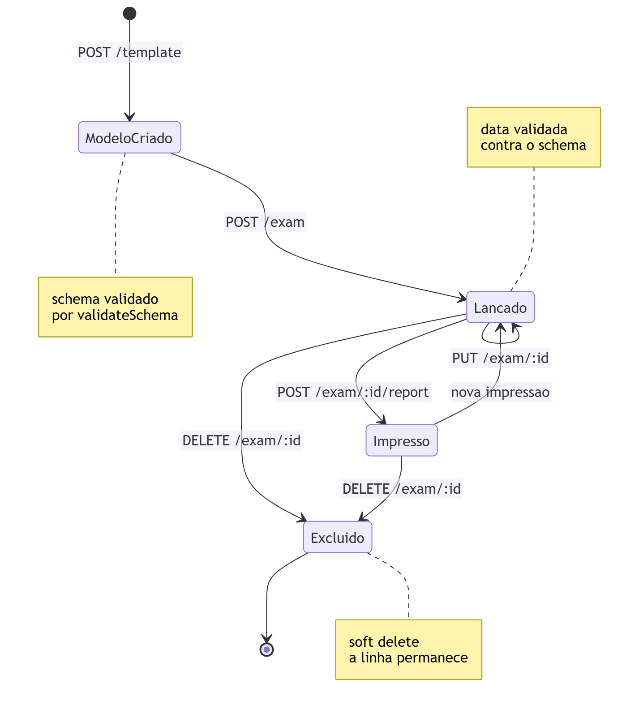
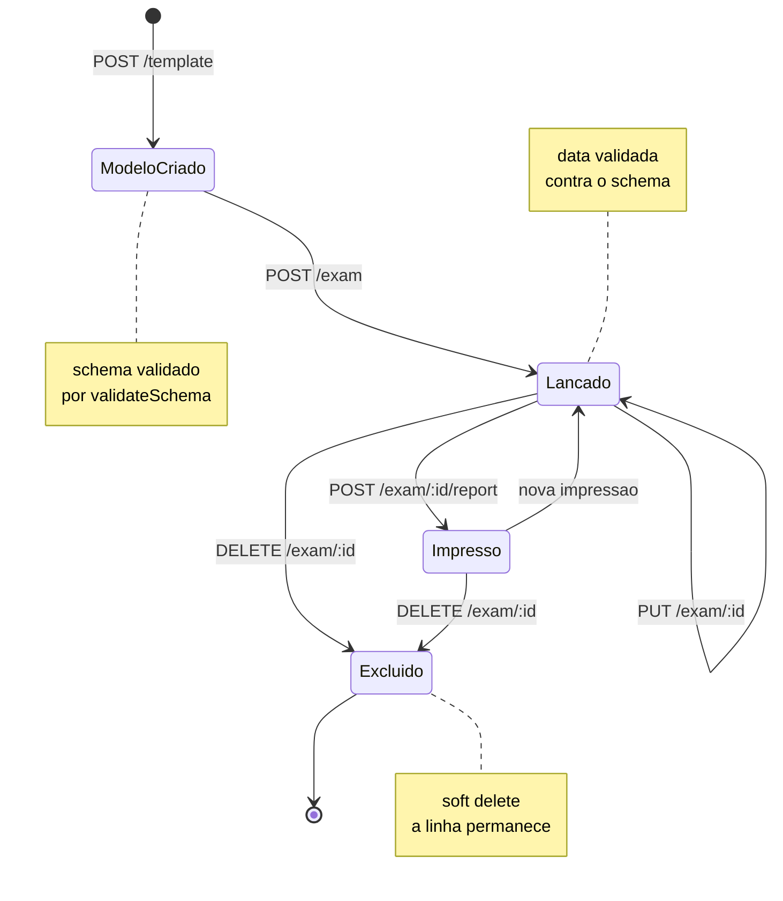
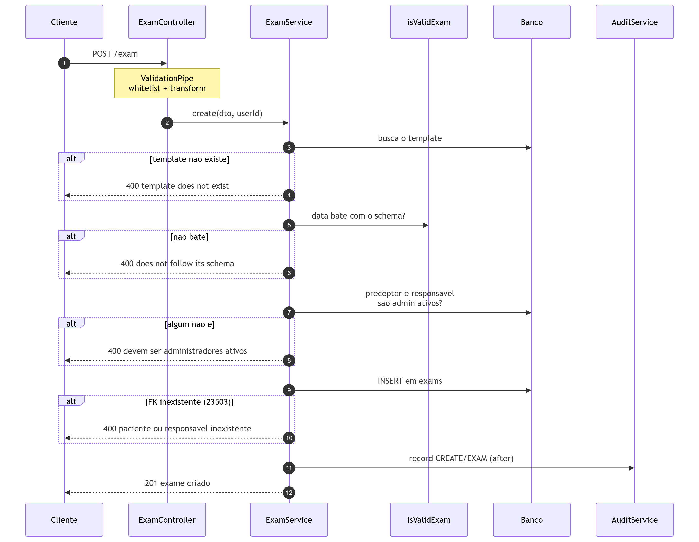
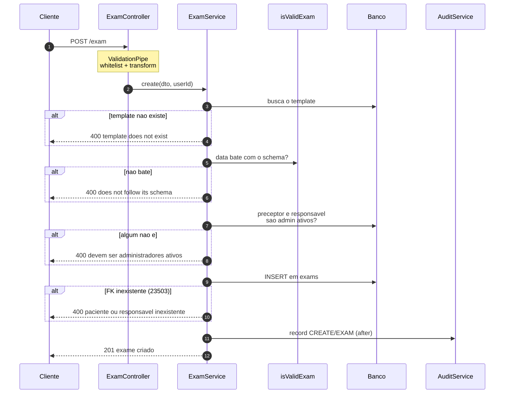
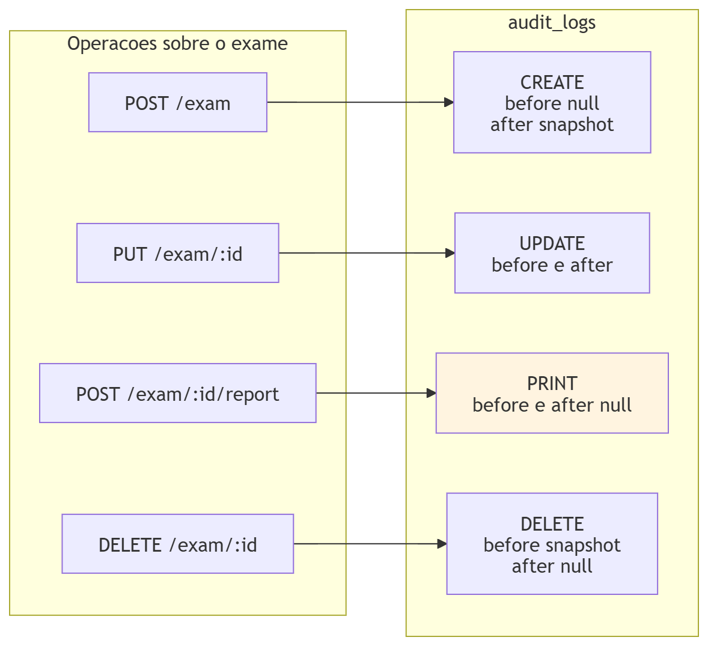
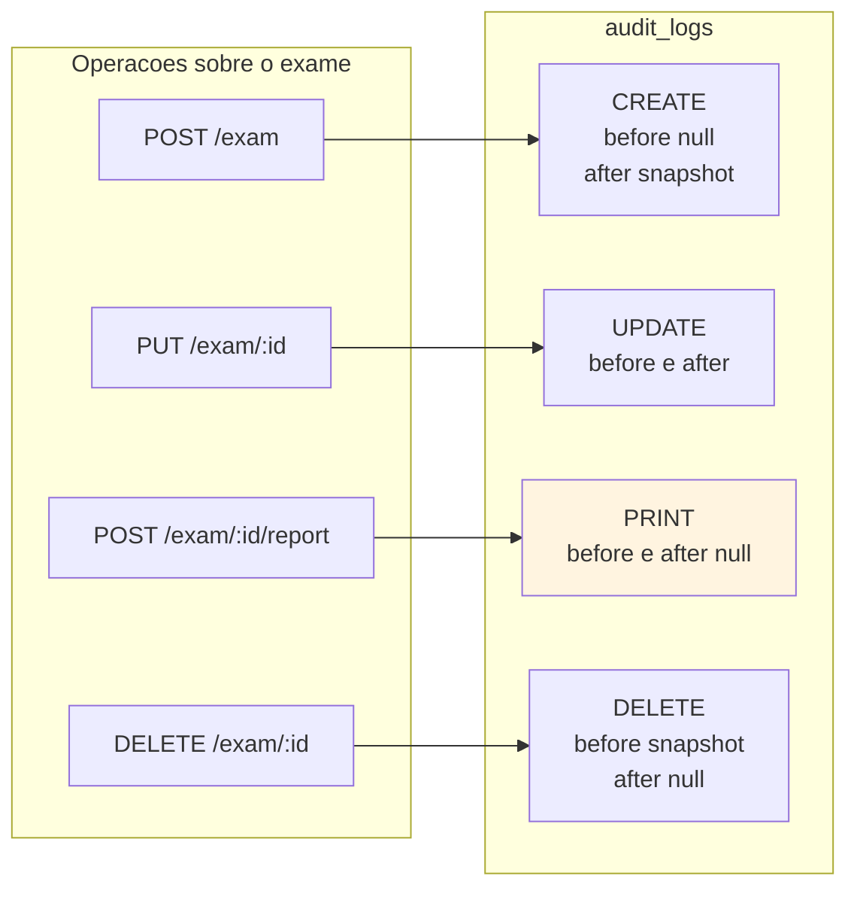
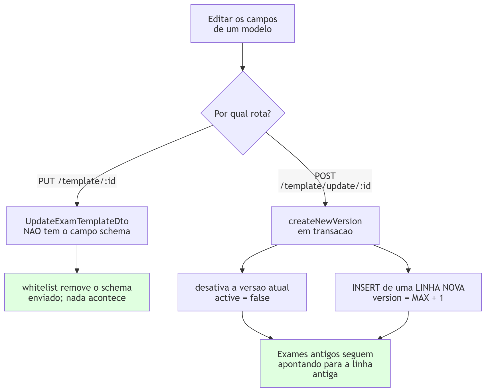
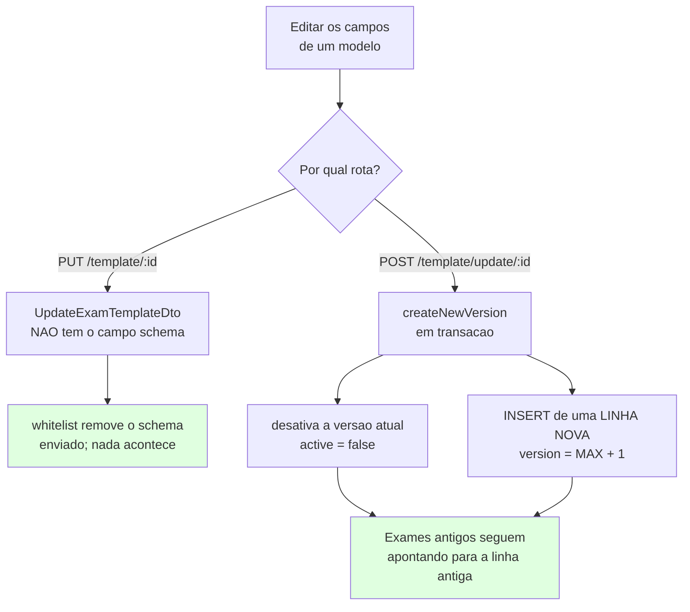

# Ciclo de vida de um exame

Do modelo ao laudo, com as validações pelo caminho e os pontos onde a auditoria
é gravada.

Um exame não é uma linha isolada: ele nasce colado a um **modelo** que define
quais campos existem, e essa colagem é mantida por código — não pelo banco.
Entender o ciclo é, em boa parte, entender essa dependência.

> **Estado:** espelha `src/exam/`, `src/exam-template/` e `src/audit/` na data
> da última atualização deste arquivo.

---

## 1. A jornada

Fonte Mermaid &middot; ampliar em <a href="img/20-jornada-do-exame.svg">SVG</a>

"Impresso" não é um estado no banco — não existe coluna que o registre. O que
existe é uma linha em `audit_logs` com ação `PRINT`. O exame em si não muda;
por isso a seta de volta, e por isso o mesmo exame pode ser impresso quantas
vezes for preciso.

Três papéis participam, e não são o mesmo:

| Ação | Exige |
| --- | --- |
| Criar e versionar o modelo | `EXAM_TEMPLATES` |
| Lançar e consultar o exame | `EXAMS` ou `EXAM_TEMPLATES` |
| Emitir o laudo | `EXAMS` ou `EXAM_TEMPLATES` |
| **Editar ou excluir** um exame já lançado | **só `EXAM_TEMPLATES`** |

Quem tem `EXAMS` lança e imprime, mas não desfaz. Corrigir um exame já lançado é
uma permissão à parte — a mesma que gerencia os modelos.

---

## 2. O lançamento, passo a passo

Fonte Mermaid &middot; ampliar em <a href="img/21-lancamento-de-exame.svg">SVG</a>

Quatro barreiras antes do `INSERT`, e cada uma existe por um motivo diferente:

**O `ValidationPipe` global** roda com `whitelist: true` — campo que o DTO não
declara é **removido em silêncio**, não rejeitado. Isso importa mais adiante
(seção 4).

**`isValidExam(data, schema)`** exige o **mesmo conjunto de chaves**, mesma
quantidade e mesmos nomes, e valores escalares — `number`, `string` ou `null`.
Objeto ou array aninhado como resultado de exame é recusado. A ordem das chaves
não conta: a comparação é por conjunto, não por serialização.

**`assertExamStaff`** repete no serviço a regra que o formulário já aplica: só
administradores ativos podem ser preceptor ou responsável. A repetição é
proposital — a tela é conveniência, não autorização, e um `POST` direto na API
passaria por cima dela. No `PUT`, campo ausente significa "não mexer", então só
o que veio no corpo é verificado.

**O `catch` de `23503`** traduz violação de chave estrangeira em `400`. Sem ele,
um `patient_id` inexistente viraria `500` — erro de servidor para o que é, na
verdade, um pedido malformado.

---

## 3. Onde a auditoria entra

Fonte Mermaid &middot; ampliar em <a href="img/22-eventos-de-auditoria.svg">SVG</a>

`PRINT` é o único evento com `before` **e** `after` nulos, e não é descuido: o
exame não muda quando alguém o imprime. O que interessa a quem audita é o evento
em si — quem, qual exame, quando — e isso já são colunas da tabela.

`registerReport` confere apenas que o exame **existe** (`select: {id: true}`);
nada do conteúdo vai para o log.

**A auditoria nunca derruba a operação.** `AuditService.record()` engole erros
de escrita e apenas os imprime no console. É deliberado: transformar uma falha
ao gravar o log num `500` faria o usuário perder uma edição que deu certo. O
preço é que uma falha de auditoria é silenciosa para quem usa o sistema —
aparece só no log da aplicação.

---

## 4. Por que o modelo é versionado, e não editado

Este é o ponto que o resto do sistema depende e que quase nada torna óbvio.

Fonte Mermaid &middot; ampliar em <a href="img/23-versionamento-de-modelo.svg">SVG</a>

Um exame guarda `exam_template_id`. Se o `schema_json` daquela linha mudasse, os
exames já lançados passariam a ter `data` que não bate mais com o modelo —
gravados, mas inválidos, e nenhuma consulta avisaria.

**A API impede isso pelo caminho mais simples que existe: o campo não está no
DTO.** `UpdateExamTemplateDto` declara `name`, `active`, `version`, `material` e
`method` — não declara `schema`. Com `whitelist: true`, um `PUT` que envie
`schema` tem o campo descartado antes de chegar ao serviço.

A única forma de mudar os campos é `POST /template/update/:id`, que **não
altera** a linha existente: desativa-a e insere outra, com `version = MAX + 1`
para aquele nome. Exame antigo continua apontando para a linha antiga, com o
schema que ele de fato usou.

Duas consequências que valem registrar:

- **`version` não é decorativo.** É o que permite ter "Hematologia v1" e
  "Hematologia v2" convivendo, uma inativa e outra ativa, com exames válidos
  presos a cada uma.
- **`GET /template` devolve só as ativas** — é o que alimenta a tela de criação
  de exame. `GET /template/all` inclui as desativadas, e é admin.

O versionamento é invisível para quem usa: o log de auditoria grava **um único
evento de edição**, com o antes e o depois do que a pessoa de fato mexeu — nome,
campos, material e método. Sem id, sem versão, sem timestamps, para não vazar a
mecânica interna para quem lê o histórico.

Do lado do banco não há nada que force isso — um `UPDATE` direto no Postgres
quebraria os exames sem reclamar. Ver
[banco-de-dados.md §8.1](banco-de-dados.md#81-examsdata--exam_templatesschema_json).

---

## 5. Edição, impressão e exclusão

**Editar** (`PUT /exam/:id`, só `EXAM_TEMPLATES`) revalida `data` contra o
schema **do modelo original do exame** — busca por `exam.examTemplateId`, não
pelo modelo ativo do momento. Um exame lançado com a v1 continua sendo validado
contra a v1.

**Imprimir** não é uma rota que devolve arquivo. O laudo é montado no navegador
(`window.print()`), e a API nunca vê o PDF — ela só recebe o aviso de que a
emissão aconteceu. Por isso a chamada é um `POST` que não retorna nada útil: o
cliente avisa antes de imprimir, e o backend registra.

Para o laudo, `GET /exam/:id` traz junto `material` e `method` **do modelo**.
Eles são fixos por tipo de exame, moram na tabela do modelo, mas quem os imprime
é o laudo — trazê-los aqui evita um `GET /template/:id` extra em toda impressão.

**Excluir** é *soft delete*: `deleted_at` recebe a data e a linha permanece. O
exame some das consultas e continua existindo para o histórico. O log guarda o
snapshot completo em `before`, que é o que sobra de legível depois que a linha
sai de todas as listagens.

---

## 6. Pontos de atenção

**A validação do exame é toda em JavaScript.** O Postgres aceita qualquer
`jsonb` em `exams.data`; quem garante a forma é `isValidExam`. Uma escrita que
não passe pela API — um script de migração de dados, um `INSERT` manual —
contorna a regra inteira sem erro nenhum.

**A checagem de nome duplicado em `ExamTemplateService.update` nunca dispara.**
A condição é `if (existingTemplate && examTemplate.id !== id)`, e `examTemplate`
acabou de ser buscado por `findOneBy({id})` — o segundo termo é sempre falso.
Além disso `existingTemplate` vem de `findBy`, que devolve array: sempre
truthy, mesmo vazio. O `ConflictException` é inalcançável, e renomear um modelo
para um nome já em uso passa.

**Preceptor e responsável precisam ser administradores.** Não é um papel
(`EXAMS`, `EXAM_TEMPLATES`) — é a coluna `is_admin`. Quem tem o papel `EXAMS`
pode lançar um exame, mas não pode assiná-lo como preceptor. Vale ao revisar a
Fase 6 de [ROLES_E_PERMISSOES.md](../ROLES_E_PERMISSOES.md), que remove o
`isAdmin` legado: esta regra depende dele.

**Não há índice em `exams.patient_id` nem em `exams.date`.** `GET
/exam/patient/:id` filtra por um e ordena pelos dois — é a consulta mais
frequente da tela de exames. Ver
[banco-de-dados.md §10](banco-de-dados.md#10-inventário-de-índices).

---

## 7. O que este documento não cobre

- **O schema das tabelas** envolvidas: [banco-de-dados.md](banco-de-dados.md).
- **Quem pode chamar cada rota**:
  [autenticacao-e-autorizacao.md](autenticacao-e-autorizacao.md) e
  [contrato-front-back.md](contrato-front-back.md).
- **Como os módulos se conectam**: [modulos-nestjs.md](modulos-nestjs.md).
- **A geração do PDF**, que acontece inteira no front.
