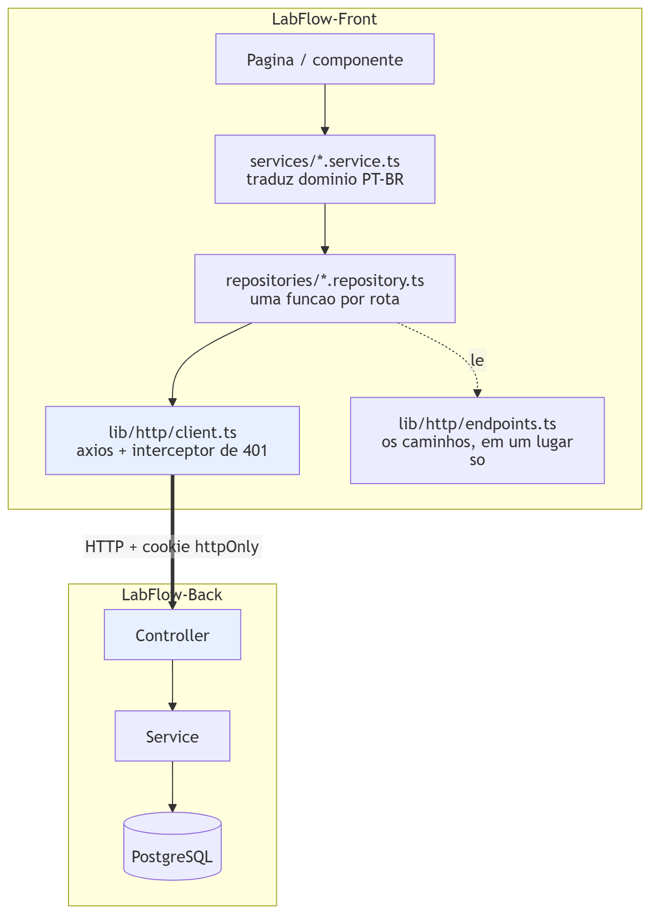
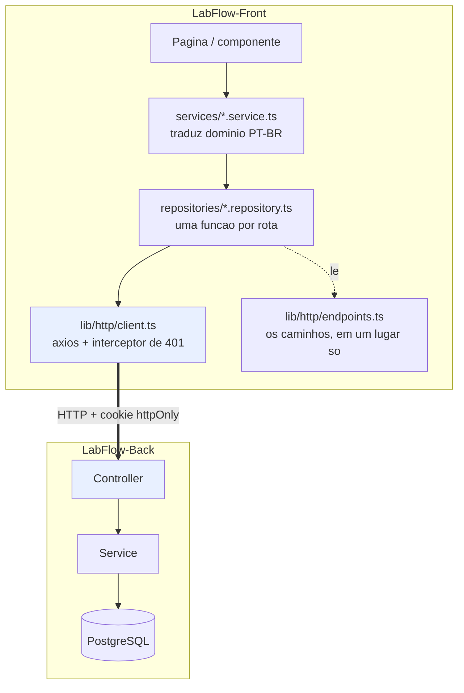
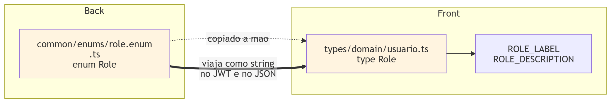
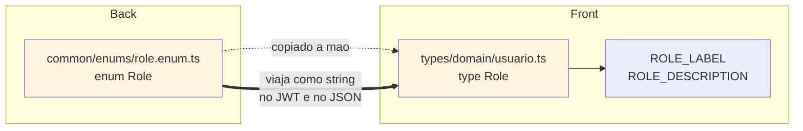
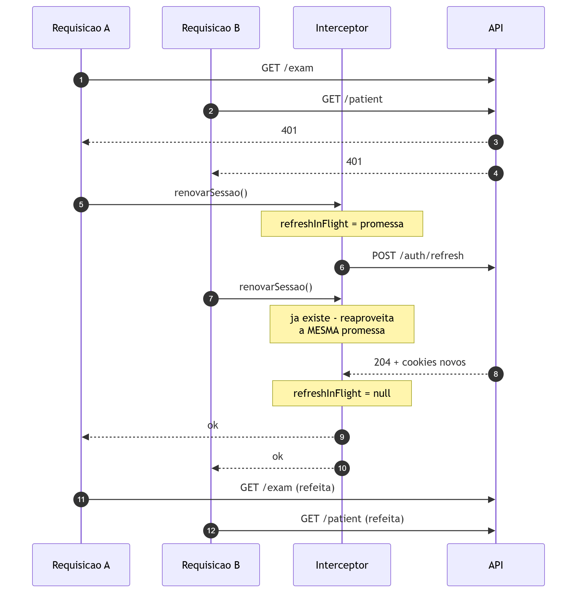
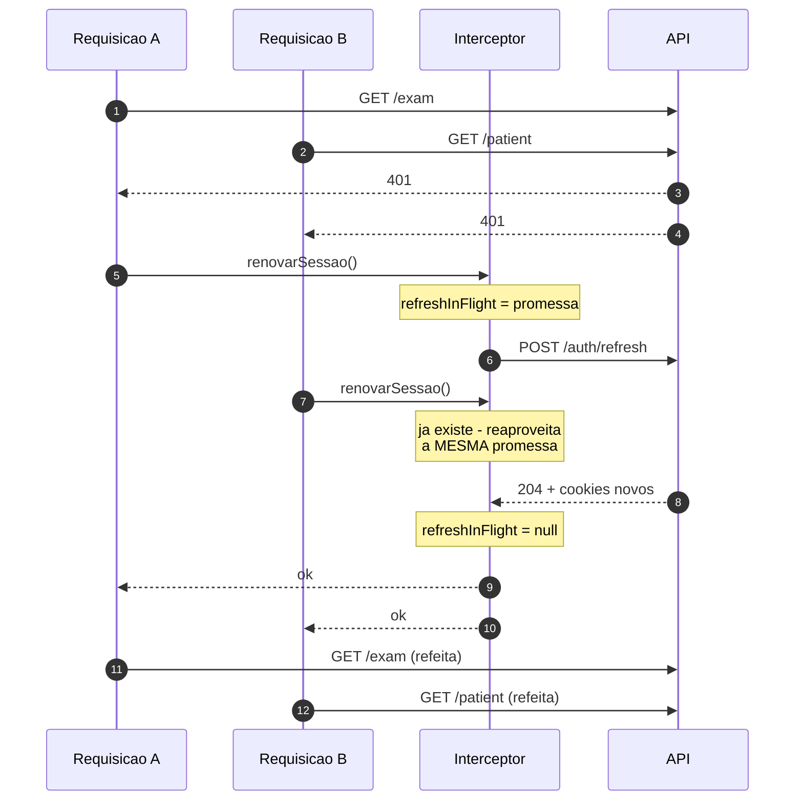

# Contrato front ↔ back

O que os dois repositórios combinaram entre si — e onde essa combinação está
escrita duas vezes, com o risco que isso traz.

Este é o único documento desta pasta que olha para fora do backend. Ele lê o
[LabFlow-Front](https://github.com/Matheusl-Silva/LabFlow-Front) e o compara
com a API, porque a maior parte dos bugs de integração não está em nenhum dos
dois lados: está na diferença entre o que um assume e o que o outro faz.

> **Estado:** compara `src/lib/http/`, `src/providers/AuthProvider.tsx`,
> `src/types/domain/usuario.ts` e `src/app/(private)/*/layout.tsx` do front com
> os controllers e guards da API, na data da última atualização deste arquivo.

---

## 1. Como o front chega até a API

O front é camadas, e cada uma só conhece a de baixo. A fronteira entre os dois
repositórios é uma linha só: o `httpClient`.

Fonte Mermaid &middot; ampliar em <a href="img/15-camadas-front-back.svg">SVG</a>

Duas consequências práticas dessa forma:

**Todos os caminhos vivem em `endpoints.ts`.** Nenhum repository escreve
`"/exam/" + id` na mão. Renomear uma rota na API quebra um arquivo, não vinte —
e é por isso que esse arquivo é o lugar certo para procurar o contrato.

**O front traduz o domínio na camada de service.** A API fala inglês
(`patient`, `exam`, `roles`); a interface fala português (`paciente`, `exame`,
`papéis`). A tradução acontece em `services/`, e é deliberada: mudar o
vocabulário da tela não mexe em requisição nenhuma.

---

## 2. O mapa completo

As 49 rotas, o papel que cada uma exige e onde o front a chama. `—` significa
que o front não usa aquela rota.

| Rota | Exige | `endpoints.*` |
| --- | --- | --- |
| `POST /auth/signup` | público | `auth.register` |
| `POST /auth/signin` | público | `auth.login` |
| `POST /auth/refresh` | público | `auth.refresh` |
| `POST /auth/forgot-password` | público | `auth.forgotPassword` |
| `POST /auth/reset-password` | público | `auth.resetPassword` |
| `POST /auth/logout` | público | `auth.logout` |
| `GET /user` | autenticado | `usuarios.base` |
| `GET /user/exam-staff` | autenticado | `usuarios.examStaff` |
| `GET /user/:id` | autenticado | `usuarios.byId` |
| `POST /user` | **ADMIN** | `usuarios.base` |
| `PUT /user/:id` | **ADMIN** | `usuarios.byId` |
| `DELETE /user/:id` | **ADMIN** | `usuarios.byId` |
| `GET /patient` | PATIENTS · EXAMS · EXAM_TEMPLATES · ANAMNESIS | `pacientes.base` |
| `GET /patient/:id` | PATIENTS · EXAMS · EXAM_TEMPLATES · ANAMNESIS | `pacientes.byId` |
| `POST /patient` | PATIENTS | `pacientes.base` |
| `PUT /patient/:id` | PATIENTS | `pacientes.byId` |
| `DELETE /patient/:id` | PATIENTS | `pacientes.byId` |
| `GET /template` | EXAM_TEMPLATES · EXAMS | `templates.base` |
| `GET /template/all` | EXAM_TEMPLATES | `templates.all` |
| `GET /template/:id` | EXAM_TEMPLATES · EXAMS | `templates.byId` |
| `POST /template` | EXAM_TEMPLATES | `templates.base` |
| `POST /template/update/:id` | EXAM_TEMPLATES | `templates.newVersion` |
| `PUT /template/:id` | EXAM_TEMPLATES | `templates.byId` |
| `DELETE /template/:id` | EXAM_TEMPLATES | `templates.byId` |
| `GET /exam` | EXAMS · EXAM_TEMPLATES | `exam.base` |
| `GET /exam/:id` | EXAMS · EXAM_TEMPLATES | `exam.byId` |
| `GET /exam/patient/:id` | EXAMS · EXAM_TEMPLATES | `exam.byPatient` |
| `POST /exam` | EXAMS · EXAM_TEMPLATES | `exam.base` |
| `POST /exam/:id/report` | EXAMS · EXAM_TEMPLATES | `exam.report` |
| `PUT /exam/:id` | **EXAM_TEMPLATES** | `exam.byId` |
| `DELETE /exam/:id` | **EXAM_TEMPLATES** | `exam.byId` |
| `POST /anamnesis` | ANAMNESIS | `anamnese.base` |
| `GET /anamnesis/:id` | ANAMNESIS | `anamnese.byId` |
| `GET /anamnesis/patient/:id` | ANAMNESIS | `anamnese.byPatient` |
| `PUT /anamnesis/:id` | ANAMNESIS | `anamnese.byId` |
| `DELETE /anamnesis/:id` | ANAMNESIS | `anamnese.byId` |
| `GET /audit-log` | **ADMIN** | `auditoria.base` |
| `GET /stock` | STOCK | `estoque.base` |
| `GET /stock/:id` | STOCK | `estoque.byId` |
| `POST /stock` | STOCK | `estoque.base` |
| `PUT /stock/:id` | STOCK | `estoque.byId` |
| `PATCH /stock/:id/quantity` | STOCK | `estoque.quantidade` |
| `DELETE /stock/:id` | STOCK | `estoque.byId` |
| `GET /settings` | autenticado | `settings.base` |
| `PUT /settings/logo` | **ADMIN** | `settings.logo` |
| `DELETE /settings/logo` | **ADMIN** | `settings.logo` |
| `PUT /settings/footer` | **ADMIN** | `settings.footer` |
| `DELETE /settings/footer` | **ADMIN** | `settings.footer` |
| `GET /` | **ADMIN** | — |

**Nenhuma rota órfã do lado do front:** todo caminho em `endpoints.ts` existe na
API. A recíproca tem uma exceção — `GET /`, que devolve `Hello World!` e sobrou
do esqueleto do Nest. Pelo padrão fail-closed ela hoje exige administrador, o
que é inofensivo mas também torna a raiz inútil como sonda de saúde: um
*health check* apontado para `/` recebe `401`. Ela está marcada com
`@ApiExcludeEndpoint()` e não aparece no Swagger.

Também vale notar o que **não** existe: não há rota de "quem sou eu". O perfil
só é devolvido no `POST /auth/signin`. Essa ausência é a causa da seção 5.

---

## 3. O que está escrito duas vezes

Fonte Mermaid &middot; ampliar em <a href="img/16-papeis-duplicados.svg">SVG</a>

Os seis valores de `Role` existem nos dois repositórios, e **nada verifica que
continuam iguais**. No back é um `enum` TypeScript; no front, um *union type* de
strings. Eles se encontram só em tempo de execução, como texto dentro do JWT e
do JSON.

Acrescentar um papel exige quatro edições, em dois repositórios:

1. `role.enum.ts` (back) — o valor
2. Uma migration, se o papel for concedido a alguém no *backfill*
3. `usuario.ts` (front) — o valor, o array `ROLES` e as duas legendas
4. O `layout.tsx` da área correspondente, com `RequireRole`

Esquecer o passo 3 não quebra compilação nenhuma: o papel simplesmente não
aparece no formulário de usuário, e ninguém consegue concedê-lo pela interface.

**A outra duplicação é a regra do ADMIN.** O back a implementa no `RolesGuard`
(`if (roles.includes(ADMIN)) return true`); o front, em `temPapel()`
(`roles.includes("ADMIN") || roles.includes(role)`). São duas implementações da
mesma frase — "o administrador passa em qualquer checagem" — e elas precisam
continuar concordando.

O front sabe que é defesa cosmética, e diz isso no próprio código: o
`RequireRole` existe para não renderizar uma tela que só produziria `403`, e
para dizer à pessoa o que ela deve pedir ao administrador. **Quem autoriza é a
API.**

---

## 4. Uma divergência que já existe

Os comentários de `endpoints.ts` descrevem `/stock` errado:

| `endpoints.ts` diz | A API faz |
| --- | --- |
| "Leitura: qualquer usuário" | Exige o papel `STOCK` |
| "Cadastro/edição: admin" | Exige o papel `STOCK` — não é exclusivo de admin |
| "`/quantity` liberado ao usuário comum" | Exige o papel `STOCK` |

O `StockController` tem `@Roles(Role.STOCK)` na classe e **nenhum override** nos
handlers: o papel dá acesso ao módulo inteiro, e quem não o tem não lê nem
escreve nada.

**Não é um bug de comportamento.** O `estoque/layout.tsx` usa
`<RequireRole role={"STOCK"}>`, que está certo — a tela é bloqueada para quem
deve ser bloqueado. É a documentação embutida que envelheceu, provavelmente na
migração do modelo binário admin/comum para papéis. O custo é o normal de
documentação errada: alguém vai ler o comentário, planejar em cima dele e
descobrir tarde.

Corrigir são três linhas de comentário no front.

---

## 5. As duas janelas de desatualização

O front guarda o perfil do usuário no `localStorage` e o restaura ali ao
carregar a página — `AuthProvider` chama `authService.getSession()` e nada mais.
Não há revalidação contra a API, porque não existe rota para isso.

Some-se a esses dois fatos que `POST /auth/refresh` responde `204` **sem
corpo**, e o resultado é que o perfil em cache nunca é atualizado enquanto a
sessão dura.

| | Fonte da verdade | Fica velho por |
| --- | --- | --- |
| O que a API **permite** | Papéis dentro do access token, relidos do banco a cada renovação | ≤ 15 min |
| O que a interface **mostra** | `localStorage`, gravado no último login | Até o próximo login |

O sintoma: conceder o papel `STOCK` a alguém libera a API em no máximo 15
minutos, mas o item "Estoque" **não aparece no menu** até a pessoa sair e entrar
de novo. Ela reporta que não recebeu o acesso; o administrador confere e vê o
papel lá. Os dois estão certos.

Na direção contrária o efeito é pior de entender: revogar um papel deixa o menu
mostrando uma área que já responde `403`. O `RequireRole` não salva — ele lê o
mesmo cache desatualizado.

Três saídas, da mais barata para a mais completa:

1. **Fazer o `/auth/refresh` devolver o perfil** junto com os cookies novos, e o
   interceptor gravá-lo. Custo baixo; alinha as duas janelas em 15 minutos. Muda
   o contrato de `204 No Content` para `200`.
2. **Criar `GET /auth/me`** e chamá-la no `AuthProvider` ao montar. Resolve
   também o caso de abrir uma aba depois de dias, e dá ao front uma forma de
   confirmar a sessão sem depender de cache.
3. **Aceitar a defasagem e explicá-la na interface** — um aviso de "saia e entre
   novamente para ver as áreas liberadas" na tela de gestão de usuários. Custo
   quase zero, mas empurra o problema para a pessoa.

A opção 1 é a que eu escolheria: é uma linha no controller e uma no interceptor,
e elimina a assimetria em vez de documentá-la.

---

## 6. A renovação automática, e a corrida que ela evita

Fonte Mermaid &middot; ampliar em <a href="img/17-renovacao-automatica.svg">SVG</a>

A variável `refreshInFlight` no `client.ts` é o que impede um desastre
silencioso. Sem ela, uma tela que dispara cinco requisições em paralelo tomaria
cinco `401` e faria **cinco renovações concorrentes** — e como o refresh é
rotativo, as quatro últimas apresentariam um token já consumido. A API
interpretaria isso como cookie copiado e derrubaria a sessão inteira.

Existe uma segunda rede de proteção, do lado da API: a **janela de tolerância**
de 30 segundos (`REFRESH_REUSE_GRACE_SECONDS`), que trata o reenvio de um token
recém-rotacionado como corrida entre abas em vez de roubo. Ela cobre o que o
`refreshInFlight` não alcança — abas diferentes têm cada uma o seu interceptor,
e nenhuma sabe da outra.

As duas proteções são necessárias, e é útil saber qual cobre o quê:
`refreshInFlight` resolve a concorrência **dentro de uma aba**; a janela de
tolerância resolve **entre abas**. Detalhes em
[autenticacao-e-autorizacao.md](autenticacao-e-autorizacao.md#3-o-ciclo-de-vida-de-uma-sessão).

Duas regras completam o interceptor:

- **Só `401` significa "a sessão acabou".** Rede fora, timeout e `5xx` são
  transitórios; tratá-los como sessão morta desconectaria o usuário e faria ele
  perder o que estivesse preenchendo por causa de uma oscilação.
- **Rotas `/auth/*` nunca entram no ciclo.** Um `401` em `/auth/signin` é senha
  errada, não token vencido — renovar ali seria tentar consertar o que não
  quebrou.

---

## 7. Pontos de atenção

**`NEXT_PUBLIC_API_URL` é embutida no bundle em tempo de build.** Não adianta
defini-la no `env_file` do container: ela precisa chegar como *build arg*, e o
`docker-compose.yaml` do backend já faz isso. Trocar o backend de endereço exige
**recompilar** o front, não reiniciá-lo.

**`withCredentials: true` é obrigatório e fácil de perder.** Sem essa flag o
navegador não envia os cookies em requisição cross-origin, e toda chamada sai
sem autenticação — com sintoma de `401` em tudo, que parece problema de token.

**O `localStorage` do front não é credencial.** Guarda nome e papéis para a tela
montar sem esperar requisição. Adulterá-lo muda o menu que aparece, nunca o que
a API deixa fazer.

**O laudo é montado no navegador.** `POST /exam/:id/report` não devolve arquivo:
ela só grava no histórico quem imprimiu e quando. O PDF nunca passa pela API.

---

## 8. O que este documento não cobre

- **Como a API decide** quem passa: [autenticacao-e-autorizacao.md](autenticacao-e-autorizacao.md).
- **A regra de negócio de cada papel**: [ROLES_E_PERMISSOES.md](../ROLES_E_PERMISSOES.md).
- **A arquitetura interna do front** — componentes, estado, formulários. Isso é
  assunto do repositório do front, e deveria ser documentado lá.
- **O formato dos corpos de requisição e resposta.** Estão nos DTOs, expostos
  pelo Swagger em `/api/docs`.
