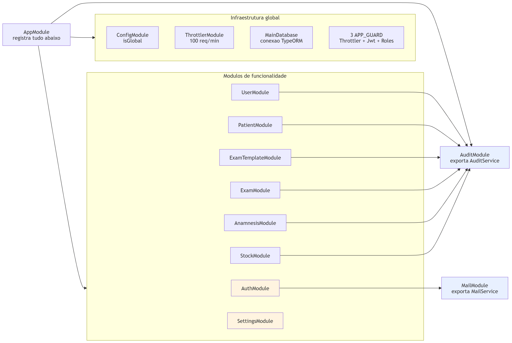
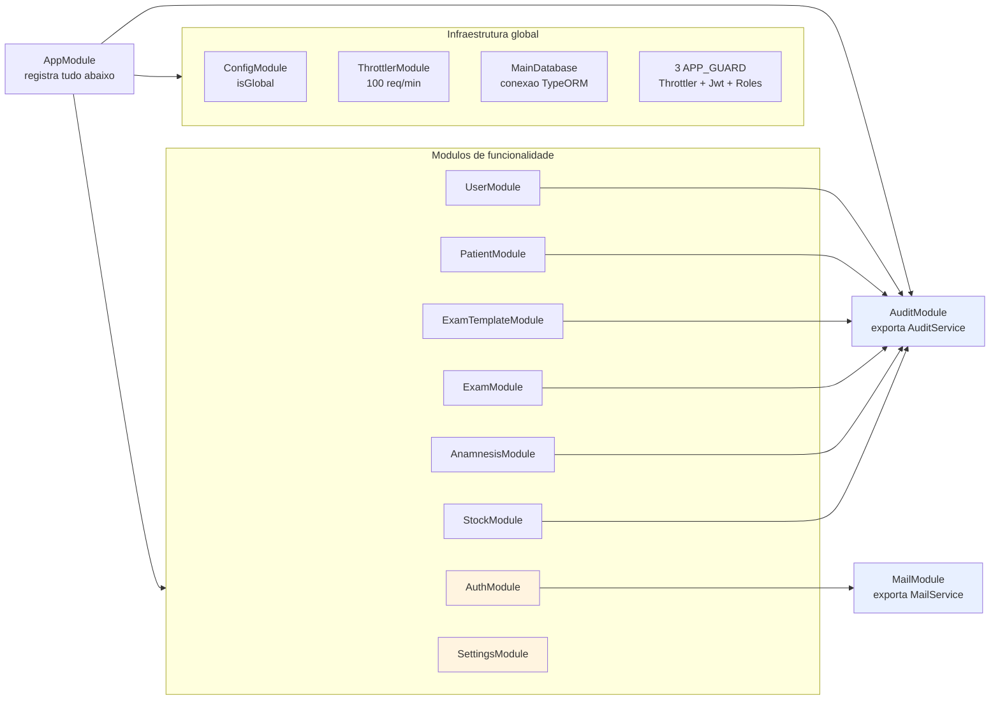
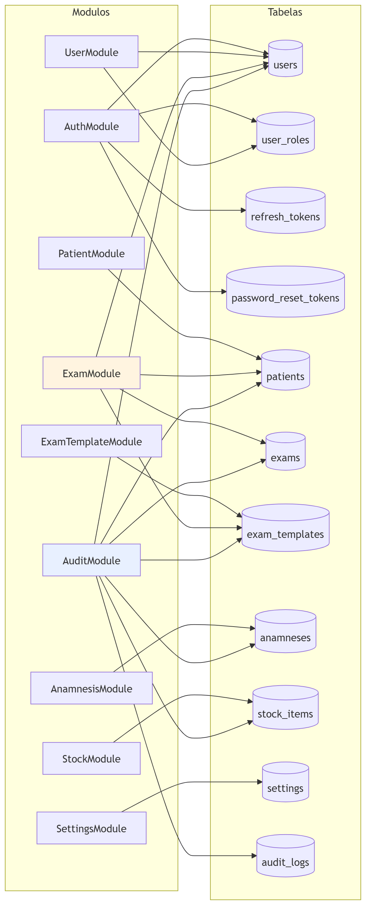
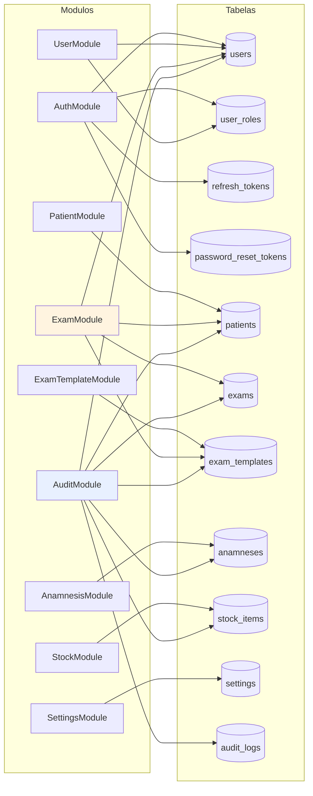

# Módulos NestJS

Quem importa quem, quem exporta o quê, e quais tabelas cada módulo alcança.

O grafo é raso de propósito: quase todo módulo depende só do `AppModule` acima
e do TypeORM abaixo. Há exatamente **dois módulos compartilhados** —
`AuditModule` e `MailModule` — e é neles que a arquitetura tem alguma
profundidade.

> **Estado:** espelha `src/app.module.ts` e os dez `src/*/*.module.ts` na data
> da última atualização deste arquivo.

---

## 1. O grafo

Fonte Mermaid &middot; ampliar em <a href="img/18-grafo-de-modulos.svg">SVG</a>

**`AuditModule` é o hub.** Seis dos oito módulos de funcionalidade o importam,
e ele é o único que existe tanto como funcionalidade (a rota `GET /audit-log`)
quanto como serviço dos outros. Ele é registrado no `AppModule` **e** importado
por cada um deles — o Nest reaproveita a mesma instância; a importação repetida
é o que dá acesso ao `AuditService` exportado.

**Dois módulos estão em laranja porque não auditam nada** — assunto da seção 3.

**Não há dependência entre módulos de funcionalidade.** `ExamModule` não importa
`PatientModule` nem `UserModule`; quando precisa de um paciente ou de um
usuário, ele registra a *entidade* e vai direto ao repositório. É uma escolha
com preço, e a próxima seção mostra qual.

---

## 2. Quem alcança quais tabelas

Fonte Mermaid &middot; ampliar em <a href="img/19-quem-le-quais-tabelas.svg">SVG</a>

Dois módulos alcançam bem mais que a própria tabela, por razões diferentes:

**`ExamModule` lê quatro tabelas** porque lançar um exame exige verificar quatro
coisas ao mesmo tempo: que o modelo existe, que os dados batem com o schema
dele, e que preceptor e responsável são administradores ativos. Fazer isso por
serviços de outros módulos criaria dependências circulares (`ExamModule` →
`UserModule` → `AuditModule` → entidade `Exam`); ir direto ao repositório evita
o ciclo, ao custo de duas regras de negócio de usuário morarem no serviço de
exame.

**`AuditModule` lê sete tabelas** porque resolve o nome de quem fez a ação e o
nome do registro afetado. Sem isso a tela mostraria "Paciente #42", e quem lê o
log teria de cruzar com outra listagem — que nem sequer traz registros
excluídos, justo o caso em que o histórico mais importa. Ele consulta **uma vez
por tipo de entidade presente na página**, não uma vez por linha: no pior caso
seis consultas, independentemente do tamanho da página.

### Três registros que não fazem nada

`UserModule`, `PatientModule` e `ExamTemplateModule` declaram a entidade `Exam`
no `TypeOrmModule.forFeature([...])` e **nenhum dos três injeta esse
repositório**. O diagrama acima já omite essas três setas, porque elas
descreveriam um acoplamento que não existe.

Não quebra nada — registra um provider que ninguém pede. Mas engorda o grafo de
dependências e sugere um acoplamento inexistente para quem estiver decidindo o
que pode mexer sem afetar o quê. São três remoções de uma palavra cada.

---

## 3. O que não é auditado

`AuditModule` é importado por seis módulos. Os outros dois **não gravam nada no
histórico**, e vale saber quais:

| Módulo | O que escapa do log |
| --- | --- |
| `SettingsModule` | Trocar ou remover a logo e o rodapé do laudo |
| `AuthModule` | Login, logout, redefinição de senha, revogação de sessão |

Os dois casos são diferentes:

**Configurações é uma lacuna.** Trocar a logo e o rodapé altera **todo laudo
impresso a partir dali**, é ação exclusiva de administrador, e não deixa
rastro. O enum `AuditEntity` nem sequer tem um valor `SETTINGS` — então não é
um `record()` esquecido, é uma decisão que ninguém tomou explicitamente.

**Autenticação é deliberado.** Os eventos de sessão vão para o `Logger` do
Nest, não para a tabela: tentativa de reúso de refresh token, redefinição de
senha, queda de família de sessões. Ficam no log da aplicação porque são
diagnóstico de segurança, não histórico de quem mexeu em qual registro — que é
o que a tabela `audit_logs` responde. Ver
[autenticacao-e-autorizacao.md](autenticacao-e-autorizacao.md).

O que **é** auditado, por serviço:

| Serviço | Eventos gravados |
| --- | --- |
| `ExamService` | `CREATE` · `UPDATE` · `PRINT` · `DELETE` |
| `StockService` | `CREATE` · `UPDATE` · `ADJUST` · `DELETE` |
| `PatientService` | `CREATE` · `UPDATE` · `DELETE` |
| `ExamTemplateService` | `CREATE` · `UPDATE` · `DELETE` |
| `AnamnesisService` | `CREATE` · `UPDATE` · `DELETE` |
| `UserService` | `CREATE` · `UPDATE` · `DELETE` |

`PRINT` e `ADJUST` são os dois eventos que não correspondem a um verbo de CRUD:
o primeiro registra a emissão de um laudo (ver
[ciclo-de-vida-de-um-exame.md](ciclo-de-vida-de-um-exame.md)), o segundo, uma
entrada ou saída de estoque.

---

## 4. Detalhes que só aparecem no código

**`JwtModule.register({})` aparece duas vezes** — em `AuthModule` e em
`UserModule` — com objeto vazio nos dois. O segredo e a validade não vêm daqui:
são passados na assinatura de cada token. `UserModule` o registra porque cria
usuários com senha, e reaproveita o mesmo serviço.

**`ConfigModule` é global.** Nenhum módulo precisa importá-lo para injetar
`ConfigService`. É a única exceção à regra de que módulo Nest só enxerga o que
importa.

**Os três guards são providers do `AppModule`, não de cada módulo.** É o que os
faz valer para toda rota da aplicação, inclusive as que ainda não existem. A
ordem em que estão declarados é a ordem em que rodam, e ela importa — ver
[autenticacao-e-autorizacao.md §1](autenticacao-e-autorizacao.md#1-a-cadeia-de-guards).

**`MailModule` não tem controller.** É só um provider exportado: o envio de
e-mail nunca é uma rota, sempre um efeito de outra operação.

---

## 5. O que este documento não cobre

- **A cadeia de guards em detalhe**: [autenticacao-e-autorizacao.md](autenticacao-e-autorizacao.md).
- **As tabelas em si** — colunas, índices, relacionamentos:
  [banco-de-dados.md](banco-de-dados.md).
- **O caminho de uma operação através dos módulos**:
  [ciclo-de-vida-de-um-exame.md](ciclo-de-vida-de-um-exame.md).
