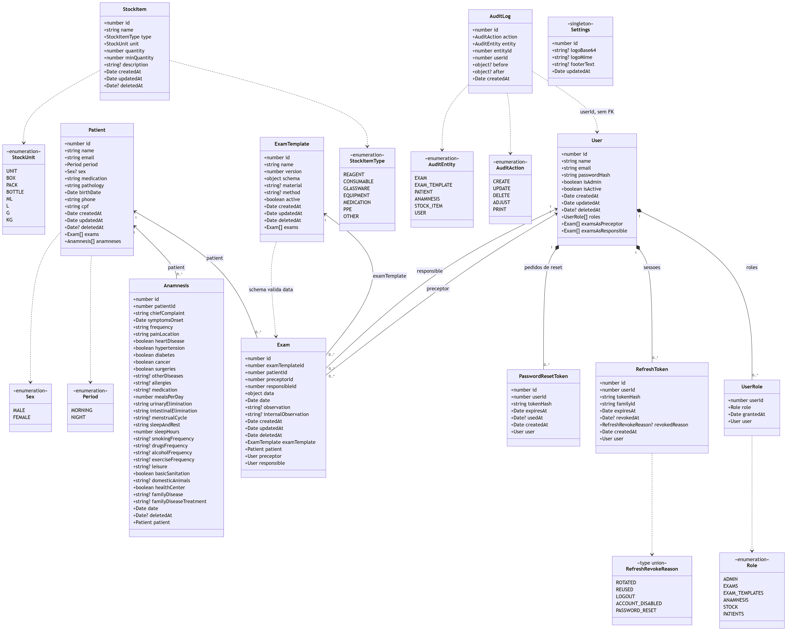
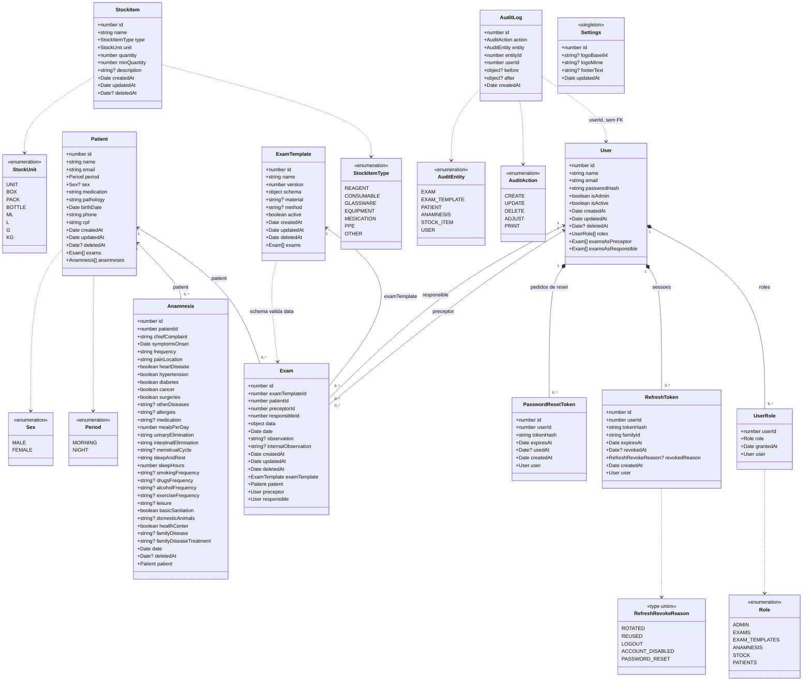

# Diagrama de classes (UML) — camada de entidades

As classes de `src/entities/` como o TypeScript as vê: tipos da linguagem,
propriedades de navegação e os enums que definem os valores possíveis.

**Não é o mesmo desenho que o [modelo do banco](banco-de-dados.md).** Ali estão
tabelas, colunas `snake_case` e tipos SQL; aqui estão classes, propriedades
`camelCase` e tipos TypeScript. Duas visões do mesmo domínio, em camadas
diferentes — e é justamente na diferença entre elas que moram os bugs
(`passwordHash` é a única coluna que não muda de nome entre as duas, por
acidente e não por escolha).

> **Estado:** espelha `src/entities/*.entity.ts`, `src/common/enums/role.enum.ts`
> e `src/audit/audit.types.ts` na data da última atualização deste arquivo.

---

## O diagrama



<details>
<summary>Fonte Mermaid &middot; ampliar em <a href="img/09-uml-classes.svg">SVG</a></summary>



</details>

Versão para ampliar ou imprimir: **[PNG](img/09-uml-classes.png)** ·
**[SVG](img/09-uml-classes.svg)** (vetorial, amplia sem borrar).

---

## Como ler a notação

| Símbolo | Significado | Onde aparece aqui |
| --- | --- | --- |
| `◆──` losango cheio | **Composição** — a parte não sobrevive ao todo | `User` → `UserRole`, `RefreshToken`, `PasswordResetToken`: são os três `ON DELETE CASCADE` |
| `◄──` seta cheia | **Associação** — a parte tem vida própria | `Patient` ← `Exam`: o exame não é destruído com o paciente (`NO ACTION` + soft delete) |
| `┄►` seta tracejada | **Dependência** — usa, mas não contém | Classe → enum, e `AuditLog` → `User`, que é referência **sem chave estrangeira** |
| `1` / `0..*` | Multiplicidade | Um usuário tem zero ou mais papéis; um papel pertence a exatamente um usuário |
| `+` | Visibilidade pública | Todas — entidades TypeORM não têm campo privado |
| `Tipo?` | Aceita `null` | `Sex?`, `Date?`, `string?` |

A distinção entre losango e seta é a mesma decisão de `ON DELETE` documentada em
[banco-de-dados.md §3](banco-de-dados.md#3-cardinalidades-e-comportamento-na-exclusão) —
aqui ela aparece na forma da linha em vez de numa coluna de tabela.

---

## O que este diagrama mostra e o ER não mostrava

1. **Os oito conjuntos de valores viram caixas.** `Role`, `Period`, `Sex`,
   `StockItemType`, `StockUnit`, `AuditAction`, `AuditEntity` e o *type union*
   `RefreshRevokeReason` são invisíveis num ER — lá viram `varchar` ou `enum`
   sem os valores. Aqui cada um é uma classe com seus membros.

2. **`Role` e `RefreshRevokeReason` não são iguais aos outros.** Os dois viram
   `varchar` no banco, não tipo enum do Postgres — o valor só é validado em
   TypeScript. `Period`, `Sex`, `StockItemType` e `StockUnit` têm tipo enum de
   verdade no Postgres. A caixa parece a mesma; a garantia não é.

3. **As propriedades de navegação são bidirecionais.** `User.examsAsPreceptor` e
   `User.examsAsResponsible` existem como arrays na classe, mesmo que no banco
   só existam as colunas `preceptor_id` e `responsible_id` do lado do exame.

4. **`AuditLog` não navega para nada.** É a única classe sem uma única
   propriedade de objeto: guarda `userId` e `entityId` como números crus. A
   seta tracejada para `User` é a relação que existe só na cabeça de quem lê o
   log ([§8.3](banco-de-dados.md#8-as-quatro-relações-que-o-banco-não-conhece)).

5. **`ExamTemplate ┄► Exam` é o contrato jsonb.** `ExamTemplate.schema` (um
   `object`) define quais chaves `Exam.data` (outro `object`) pode ter. O
   TypeScript tipa os dois como `object` e não verifica nada — quem verifica é
   `isValidExam()` em tempo de execução
   ([§8.1](banco-de-dados.md#8-as-quatro-relações-que-o-banco-não-conhece)).

---

## Regerar as imagens

**A fonte Mermaid é a verdade; o PNG e o SVG são derivados dela.** Editou o
diagrama? Regere a imagem, senão as duas divergem em silêncio.

Não há script no repositório para isso — seriam duas dependências pesadas
(`mermaid` + um Chromium headless) para uma tarefa que roda umas poucas vezes
por ano. Dois caminhos, ambos sem instalar nada permanente:

**Uma alteração pontual.** Cole o conteúdo do `<details>` em
<https://mermaid.live> e use *Actions → PNG/SVG*. Baixe por cima do arquivo
correspondente em `img/`.

**Regerar tudo.** Salve cada bloco Mermaid num `.mmd` e rode o mermaid-cli:

```bash
npx -y @mermaid-js/mermaid-cli -i 09-uml-classes.mmd -o docs/diagramas/img/09-uml-classes.png -s 2 -b white
```

`-s 2` gera em 2× (é o que dá texto nítido ao ampliar) e `-b white` força fundo
branco — sem isso o PNG sai transparente e some em qualquer visualizador de
tema escuro. Troque a extensão de saída para `.svg` para gerar o vetorial.

Os arquivos atuais em `img/` foram gerados com mermaid 11.17.2, em 2× (o
`02-modelo-logico-completo` em 1,76×, limitado pelo teto de 8000 px por lado),
fundo branco, com `htmlLabels: false` — essa última opção faz o Mermaid emitir
`<text>` em vez de `<foreignObject>`, e é o que garante que o texto realmente
apareça no PNG em vez de sair só as caixas vazias.
